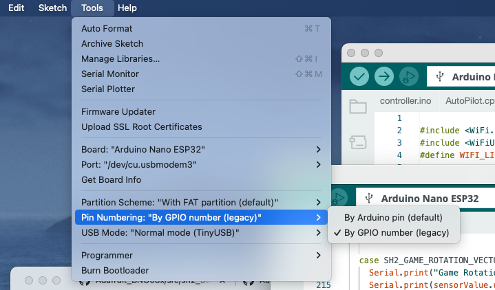

# Arduino Code for the Auto Pilot
There are 2 main Sketches for this project
1. Controller
2. Display 
## Controller 
A sketch which runs on an Arduino Nano ESP32.  When compiling this you will need to create an `arduino_secrets.h` file by copying the `arduino_secrets.h.example` file and setting the password to be the same as that on the cdisplay.

### Note
When compiling the Controller it is important that the "Pin Numbering" be set to "By GPIO Number (legacy)" as shown in this image:

## Display
One or more Arduino Nana 33 IoT which both displays the current auto pilot information and has buttons for changing from navigation to compass mode and/or disabling the auto pilot, as well as turning 1 degree, 10 degrees or 90 degrees to port or starboard if in compass mode.

When compiling this you will need to create an `arduino_secrets.h` file by copying the `arduino_secrets.h.example` file and setting the password to be the same as that on the controller.

