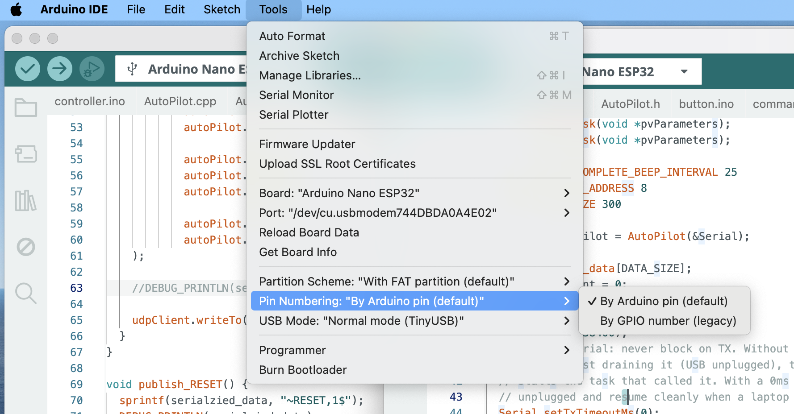

# AutoPilot (Arduino)

A two-board marine autopilot built on the **Arduino Nano ESP32**. One board (the
**controller**) reads the boat's sensors and drives the steering motor; the other
(the **display**) is the cockpit head unit with an LCD and buttons. They talk to
each other over Wi-Fi using UDP.

```
   sensors                     Wi-Fi (SoftAP "SoberPilot", 10.20.1.x)
  ┌─────────┐                 ┌──────────────────────────────────────┐
  │ compass │                 │  UDP 8888  telemetry  ~APDAT,...$  ─▶ │
  │  (IMU)  │                 │            (controller broadcasts)    │
  │  GPS    │   ┌──────────┐  │                                       │   ┌──────────┐
  │  Garmin │──▶│CONTROLLER│──┤                                       ├──▶│ DISPLAY  │
  │  NMEA   │   │  (AP)    │  │  UDP 8889  commands   ~APCMD,...$  ◀─ │   │  (STA)   │
  └─────────┘   └────┬─────┘  │            (display sends)            │   └────┬─────┘
                     │        └──────────────────────────────────────┘        │
                steering motor                                         HX8357 LCD + buttons
```

## The two sketches

### `controller/` — sensors, navigation, and steering
Acts as the Wi-Fi access point (`SoftAP` SSID **SoberPilot**, `10.20.1.x`). It
reads the sensors, decides how to steer, runs the motor, and broadcasts the boat
state to any displays on the network. Source files:

| File | Responsibility |
|------|----------------|
| `controller.ino` | `setup()`/`loop()`, FreeRTOS task wiring, top-level orchestration |
| `compass.ino` | Reads the Adafruit BNO08x IMU for heading / pitch / roll + stability |
| `gps.ino` | Parses GPS NMEA (fix, position, speed, course) via Adafruit GPS |
| `garmin.ino` | Ingests Garmin NMEA-0183 sentences (waypoint / bearing data) |
| `pid.ino` | PID loop converting heading error into a steering correction |
| `motor.ino` | Drives the steering motor (direction + timed pulses) |
| `publish.ino` | Builds and **broadcasts** `~APDAT,...$` telemetry on UDP 8888 |
| `subscribe.ino` | **Listens** on UDP 8889 for `~APCMD,...$` commands from displays |
| `telnet.ino` | Telnet console for live debugging |
| `wifi.ino` | Brings up the SoftAP |
| `AutoPilot.{h,cpp}` | Thread-safe shared state model (mutex-guarded getters/setters) |

### `display/` — cockpit head unit
Joins the controller's Wi-Fi as a station, shows the live data on the HX8357 LCD,
and sends button presses back as commands. Buttons switch between navigation and
compass mode (or disable the autopilot) and, in compass mode, turn 1°, 10° or 90°
to port or starboard. To keep the UI feeling instant it updates its own local copy
of the state immediately on a press, then transmits the change.

| File | Responsibility |
|------|----------------|
| `display.ino` | `setup()`/`loop()`, top-level orchestration |
| `screen.ino` | Renders the LCD layout (Adafruit GFX + HX8357 driver, custom fonts) |
| `button.ino` | Reads the physical buttons, applies optimistic local updates |
| `command.ino` | Sends `~APCMD,...$` command datagrams to the controller on UDP 8889 |
| `subscribe.ino` | Listens on UDP 8888 for the controller's `~APDAT,...$` telemetry |
| `volt_meter.ino` | Battery / input voltage measurement and display |
| `wifi.ino` | Connects to the **SoberPilot** access point |
| `AutoPilot.{h,cpp}` | Local mirror of the state model + the `~APDAT/~APCMD` parser |

## Communication protocol

Plain-text UDP datagrams framed with a leading `~` and trailing `$`:

- **Telemetry** — controller → displays, broadcast on **UDP 8888**:
  `~APDAT,<fields...>$` (mode, fix, heading, pitch/roll, bearing, position,
  speed, distance, etc. — see `publish.ino`/`AutoPilot::parse`).
- **Commands** — display → controller, unicast on **UDP 8889**:
  `~APCMD,<cmd>$` (mode changes, heading nudges, tack, etc.).
- **Reset** — `~RESET,1$`.

Because telemetry is broadcast, multiple displays can listen at once; commands
are unicast to the controller's AP address.

## Before you build: `arduino_secrets.h`

Each sketch needs an `arduino_secrets.h` that is not checked in. Copy the example
and set the Wi-Fi password — **it must match on the controller and every display**:

```bash
cp controller/arduino_secrets.h.example controller/arduino_secrets.h
cp display/arduino_secrets.h.example    display/arduino_secrets.h
# then edit each and set the password
```

> **Controller pin numbering:** in the Arduino IDE, set **Tools ▸ Pin Numbering**
> to **"By Arduino pin (default)"** when building, or the motor/GPS
> pin assignments will be wrong.
> 

## Required libraries

These are **not** checked into the repo. Either let `arduino-cli` install them
from the `sketch.yaml` profiles (below), or add them by hand in the Arduino IDE
via **Tools ▸ Manage Libraries…** using the names in the table. Everything else
the sketches `#include` (`WiFi`, `AsyncUDP`, `SPI`, `Wire`, `USB`,
`HardwareSerial`, `FreeRTOS`, …) ships with the ESP32 core — no install needed.

| Library (Library Manager name) | Author | Used by |
|--------------------------------|--------|---------|
| Adafruit BNO08x | Adafruit | controller |
| Adafruit GPS Library | Adafruit | controller |
| ESPTelnet | Lennart Hennigs | controller |
| PID | Brett Beauregard | controller |
| Time | Michael Margolis | both |
| Timezone | Jack Christensen | controller |
| Adafruit GFX Library | Adafruit | display |
| Adafruit HX8357 Library | Adafruit | display |

Installing the Adafruit libraries also pulls in **Adafruit BusIO** and **Adafruit
Unified Sensor** as dependencies (the IDE offers to add them automatically; the
`sketch.yaml` profiles list them explicitly).

## Building with arduino-cli

Each sketch has a `sketch.yaml` defining a profile named **`nano`** that pins the
board (`arduino:esp32:nano_nora`), the core, and the libraries above.

**One-time setup** (install arduino-cli and the ESP32 core index):

```bash
brew install arduino-cli                                   # macOS
arduino-cli config init
arduino-cli config add board_manager.additional_urls \
  https://espressif.github.io/arduino-esp32/package_esp32_index.json
arduino-cli core update-index
```

**Compile** (the first run auto-installs the core + every library in the
profile — no `Arduino/libraries` folder required):

```bash
cd Arduino/controller        # or Arduino/display
arduino-cli compile --profile nano
```

**Find your board's port, then upload:**

```bash
arduino-cli board list                                     # e.g. /dev/cu.usbmodem1101
arduino-cli upload --profile nano -p /dev/cu.usbmodem1101
```

Since each `sketch.yaml` sets `default_profile: nano`, you can drop the
`--profile nano` flag once you're used to it.

> Bump the version pins in `sketch.yaml` as new releases come out
> (`arduino-cli lib search "<name>"` shows what's available). To install just the
> libraries without compiling: `arduino-cli lib install "Adafruit BNO08x"` etc.
