# Wind sensor — assembly instructions

Masthead wind speed + direction sensor for the AutoPilot project. Based on the
**Yachta** wind sensor by Norbert Walter (Open Boat Projects), rebuilt around an
**Arduino Nano ESP32** so it joins the `SoberPilot` Wi-Fi like the rest of the
system.

Original instructions, which these are derived from:
<https://open-boat-projects.org/en/zusammenbauanleitung-windsensor-yachta/>

> **Read this before following any photo.**
> The photos in `assets/wind/` came from the original Yachta build and differ
> from what you are building in four ways:
>
> 1. **The cups.** The photos show the three cups and their hub printed as a
>    single piece. Ours are **three separate `cup_round.stl` cups glued into
>    `base_cup_wheel.stl`**, which together make the part shown in the photos.
> 2. **The board.** The photos show the original ESP8266 board. Ours is the
>    Nano ESP32 board in `circuit/Wind/`, which is longer — hence the new
>    housing.
> 3. **The housing.** `bot.stl` and `top_1.stl` have been extended with a nose
>    to cover the longer board, and **the arm-tube socket has moved 47.8 mm
>    outboard along the tube axis** — see [Step 7](#step-7--standpipe-and-mast-base).
> 4. **The bearing carrier.** `bot_ball_bearing.stl` is **5 mm longer** than the
>    original, to drop the cup wheel clear of the relocated arm socket. That
>    also means **the cup-wheel shaft screw is an M5×70, not an M5×60** — see
>    [Step 6](#step-6--cup-wheel).

---

## Contents

- [Before you start](#before-you-start)
- [Step 1 — Print](#step-1--print)
- [Step 2 — Clean and lacquer](#step-2--clean-and-lacquer)
- [Step 3 — Wind vane bearing and direction magnet](#step-3--wind-vane-bearing-and-direction-magnet)
- [Step 4 — Wind vane](#step-4--wind-vane)
- [Step 5 — Speed magnet holder and lower bearings](#step-5--speed-magnet-holder-and-lower-bearings)
- [Step 6 — Cup wheel](#step-6--cup-wheel)
- [Step 7 — Standpipe and mast base](#step-7--standpipe-and-mast-base)
- [Step 8 — Board and wiring](#step-8--board-and-wiring)
- [Step 9 — Close it up](#step-9--close-it-up)
- [Step 10 — Bench test](#step-10--bench-test)
- [Credits and licence](#credits-and-licence)

---

## Before you start

### Tools

Soldering iron and 1 mm solder · 2 mm and 2.5 mm hex keys · small Phillips
driver · 8 mm spanner (M5 nuts) · drill with a 4–5 mm bit (cable hole in the
tube) · a small hammer · tweezers · cotton buds.

### Time

An evening for assembly, but spread over **three days** because the lacquer
needs 24 h to cure and you should not handle painted parts before it has.

### The two things most likely to ruin the build

**Magnet polarity.** Both magnet installations have a polarity requirement and
both fail silently — you get plausible-looking but wrong readings. Get them
right the first time; the magnets are glued in.

**Adhesive choice.** A masthead swings through roughly −10 °C to +90 °C. Rigid
adhesives crack at that range. Use a 2-component acrylic with residual
elasticity (the original specifies **Weicon RK-1300**). Superglue is fine only
for the small captive-nut and magnet jobs called out below.

---

## Step 1 — Print

All parts are in [`3D-Parts/`](3D-Parts/). See [README.md](README.md) for what
each one is.

| Setting | Value |
|---|---|
| Material | **PETG or ASA**. Not PLA — it creeps and sags in masthead sun. |
| Colour | **White or light.** Dark filament heats enough in sun to go soft. Black PETG is explicitly unsuitable. |
| Layers | 0.2 mm |
| Walls | 3 perimeters minimum |
| Infill | 30 %+ |
| Supports | Needed for `bot.stl` (the socket keel) and the cups |

Print **three** copies of `cup_round.stl`. One each of everything else.

`bot.stl` prints best rim-down (the z = 0 face on the bed), which puts the
socket keel pointing up and needs no support under the nose.

## Step 2 — Clean and lacquer

UV and salt will chalk bare PETG within a season, and layer lines wick water.

1. Wipe every part with **99 % ethanol** on a cotton bud. Skin oil ruins adhesion.
2. Spray **three thin coats** of clear lacquer that bonds to PETG without primer
   — the original specifies Dupli-Color Aerosol Art clear. Hold the can **30 cm
   away** and keep the part turning.
3. Do the **inside of the cups** too, but sparingly — pooled lacquer in a cup
   unbalances the wheel.
4. **Cure 24 h before assembling anything.**

Do not lacquer bearing seats, the pocket the board drops into, or the magnet
recesses. Mask them or wipe them clean while wet.

## Step 3 — Wind vane bearing and direction magnet

The vane turns on a **625** bearing carried in the hub on top of `top_1.stl`,
and its shaft carries the magnet the AS5600 reads.

1. Press the **625 bearing (16×5×5)** into the hub recess on top of `top_1.stl`
   until it seats on the shoulder.
2. Pass the **M5×25 countersunk screw** up through the bearing from below.
   Fit a washer and the **M5 nut** on top. Snug only — the vane must spin
   freely; you should be able to flick it and have it coast.
3. Clamp the bearing with `fane_support_smal.stl` and **four M3×10 screws**.

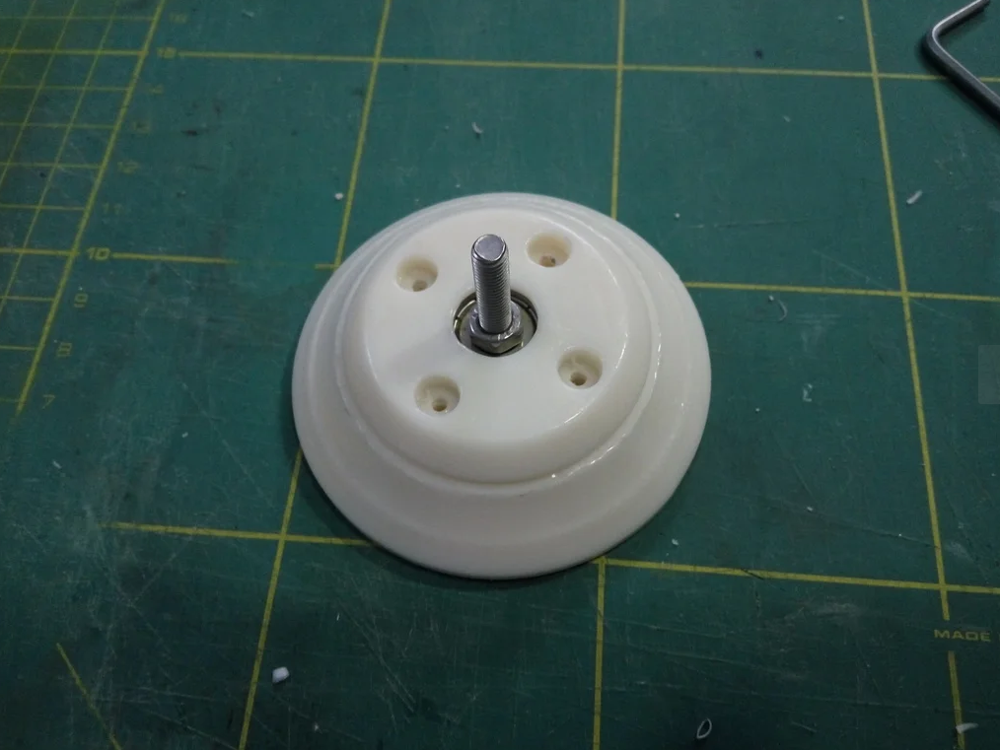
*The 625 bearing pressed into the hub, M5×25 screw through it.*

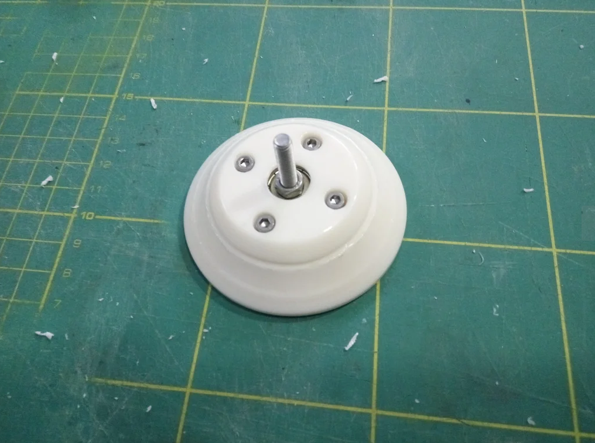
*Clamped down with the four M3×10 screws.*

### The direction magnet — read carefully

The AS5600 measures the **direction of a magnetic field across its face**, so
the magnet must be **diametrically magnetised** — poles on the sides, not on
the flat faces. An axially magnetised magnet of the same size will not work.

Glue the magnet to the **countersunk head of the M5×25 screw**, on the underside,
so it hangs about **1 mm above the AS5600** once `top_1` is on.

**Align the magnet's pole boundary parallel to the wind vane.** If you are a few
degrees out, that is a fixed offset you can correct in firmware — but get it
close.

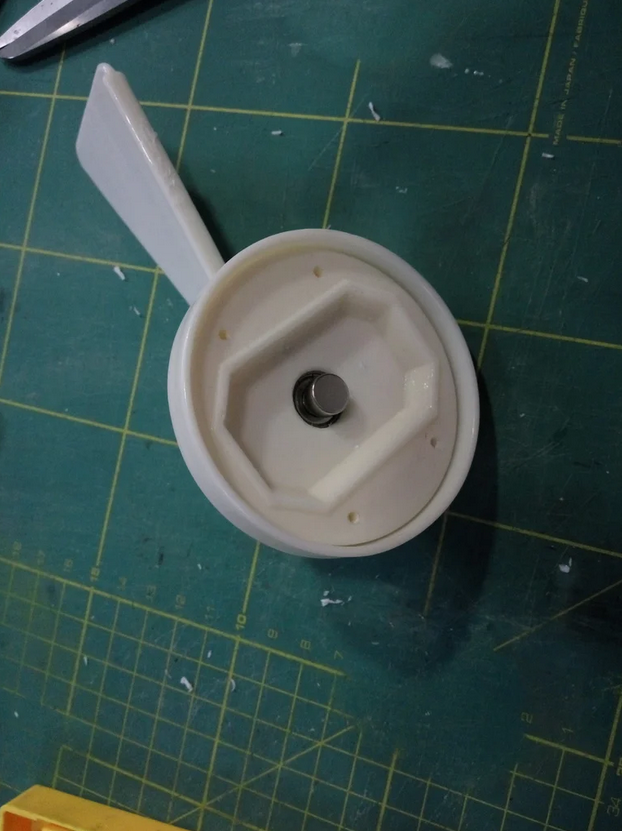
*The magnet glued to the screw head.*

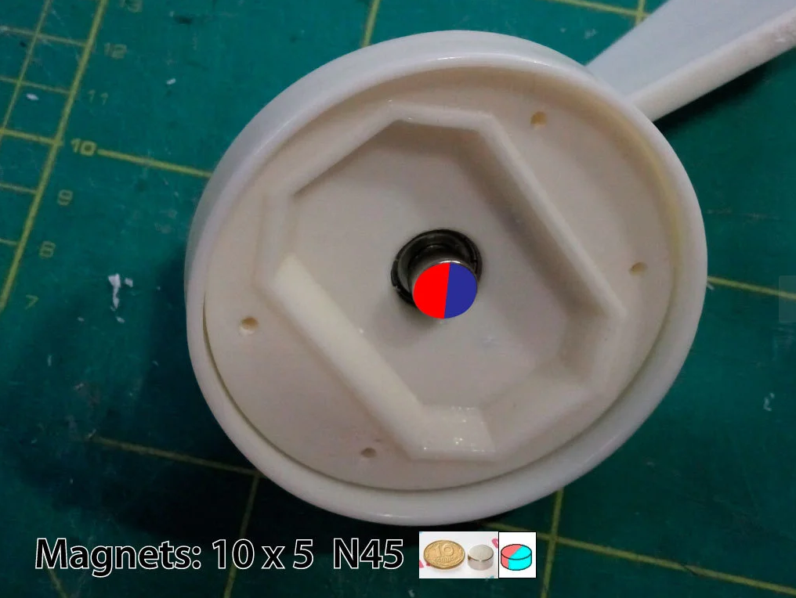
*Red/blue shows the pole split — across the diameter, not top-to-bottom.*

> **Size discrepancy — pick one and note it.** The photo above is annotated
> **10×5 mm N45**. The project's own [`Mechanics/BOM.txt`](Mechanics/BOM.txt)
> says **5×5×5 mm square**, and the upstream page says the same. Any of these
> works *provided it is diametrically magnetised* and sits ~1 mm off the chip.
> The 10×5 disc in the photo is the easier one to align, because the pole
> boundary is visible on the rim.

## Step 4 — Wind vane

1. Press the **M5 nut** into the recess in `fane.stl` and lock it with a drop of
   superglue. Let it set before loading it.
2. Fit `fane_support_big.stl` — the 78 mm dome — over the hub and onto the vane
   shaft.
3. Screw the vane onto the shaft.
4. Fit the **M6×60 screw** in the boss on the opposite side of the vane. This is
   the counterweight that balances the blade, not a fastener. The vane should
   sit roughly level and not fall to one side when you let it go.

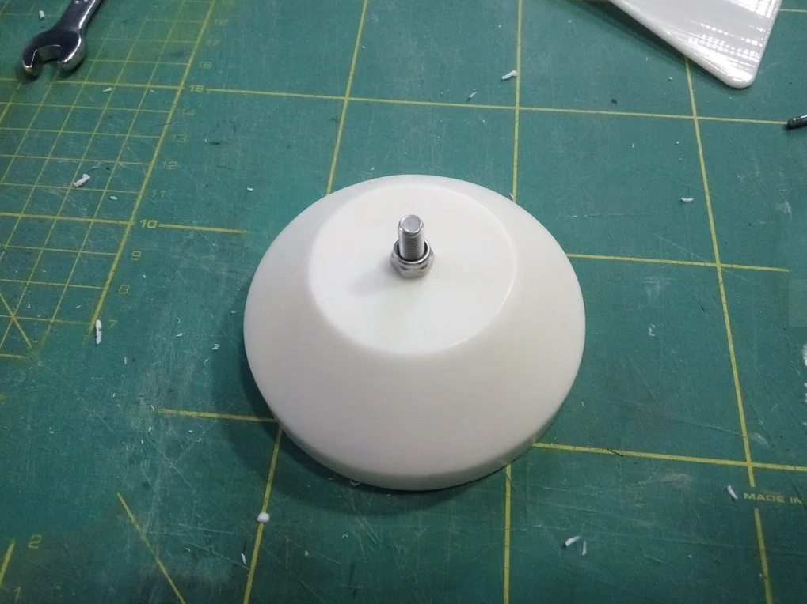
*`fane_support_big` on the hub, shaft standing proud.*

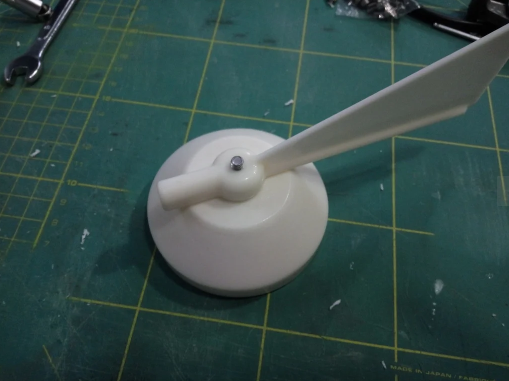
*Vane on one side, M6×60 counterweight on the other.*

## Step 5 — Speed magnet holder and lower bearings

This is the half that measures wind **speed** — a magnet ring under the cup
wheel sweeping past the hall sensor.

> Note the carrier is **5 mm longer than the original** (41 mm, not 36 mm). The
> bearing seats, the Ø31 spigot, the Ø35 flange and the three screw holes are all
> unchanged — only the stem between the bearings was stretched, to drop the cup
> wheel clear of the relocated arm socket.

1. Press the **695 bearing (13×5×4)** into the **narrow end** of
   `bot_ball_bearing.stl`.
2. Press a **625 bearing (16×5×5)** into the **flange end** until it seats.
   That flange end is the top in service — it plugs up into `bot.stl`.
3. Glue the **four 5×1.5×1 mm bar magnets** into the four slots in
   `magnetholder.stl`.

### Magnet polarity — the one that silently doubles your wind speed

The four magnets must **alternate**: N, S, N, S around the ring.

If you fit them all the same way the hall sensor sees **four** pulses per
revolution instead of two, and **every wind speed reads exactly double**. It
looks like a calibration problem, and it is not.

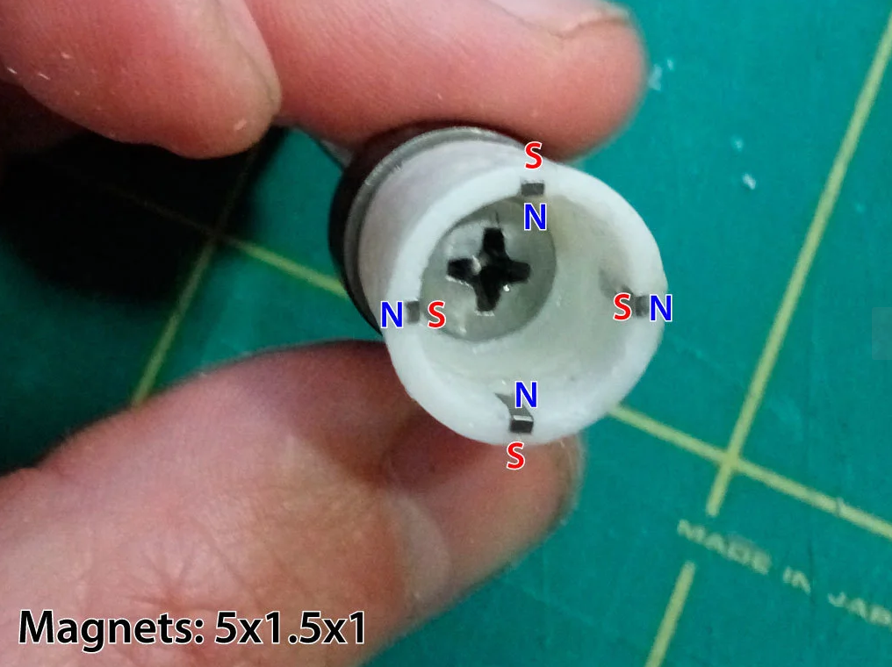
*Note the alternating N/S labels around the four slots.*

Trick for gluing: tape across the **inside** of the holder, press the magnets
into the slots from the outside so they cannot jump inward, then peel the tape
once cured.

4. Thread the **M5×70 screw** up through the magnet holder and secure it from
   below with an **M5 stop nut**.
5. Slide the assembly up into the aperture in the underside of `bot.stl`.

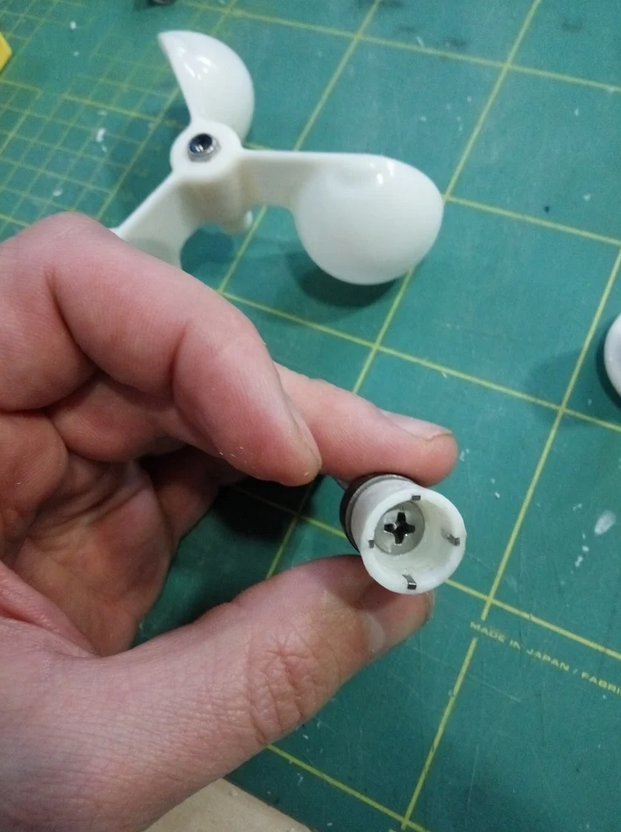
*Magnet holder on the M5×60 screw.*

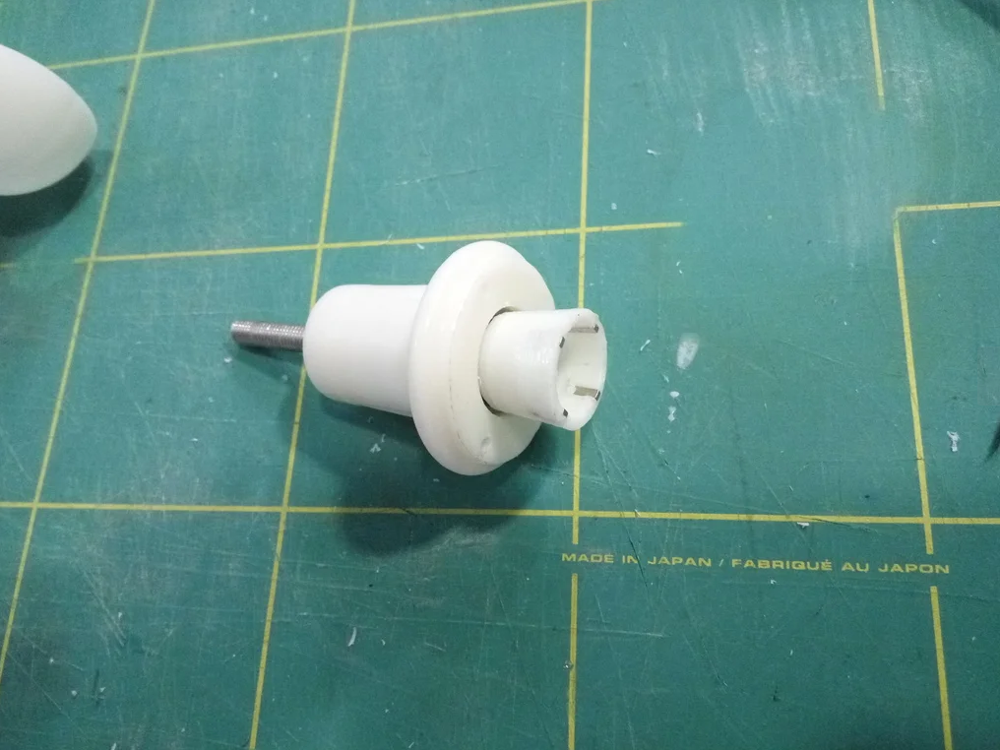
*`bot_ball_bearing` with the magnet holder through it.*

## Step 6 — Cup wheel

> **This is where our build differs from every photo below.** The photos show a
> one-piece cup wheel. Yours is four printed pieces.

1. Press the **M5 nut** into the recess in the centre of `base_cup_wheel.stl`
   and lock it with a drop of superglue.
2. **Glue the three `cup_round.stl` cups into the hub.** Slide each arm into its
   groove from below; a gentle tap with a small hammer seats the last millimetre
   or two. Do not force a cup shell — it will crack before the arm moves.
   Use the flexible 2-component acrylic here, not superglue: these joints carry
   the whole rotating load and see the full temperature swing.
   **Check all three cups face the same way round.** A cup wheel with one cup
   reversed still spins, just badly and non-linearly.
3. Let the adhesive cure fully before spinning it up.
4. Screw the completed wheel onto the shaft from Step 5.

> ### The shaft screw is an M5×70, not the M5×60 upstream lists
> Both bearings have a 5 mm bore and must run on the **unthreaded** part of the
> shank. With the longer carrier the bearing span is 35 mm, which the old
> M5×60's 35 mm plain shank no longer covers with any margin — a bearing sitting
> on thread run-out will be sloppy and will chew its bore.
>
> Use **DIN 931 M5×70** (partially threaded: 22 mm of thread, 48 mm plain). A
> *fully* threaded M5×70 is the wrong part. Check the head still drops into the
> magnet-holder recess.
5. **Set the running clearance before you lock anything.** Tighten until the
   wheel runs without endfloat but still coasts freely when flicked. Too tight
   and it will not start in light air — which is exactly when you want it.
6. Once the feel is right, lock the thread with threadlocker.
7. **The cups now hang 5 mm lower than on the original.** Before you go up the
   mast, check what is underneath — anchor light, mast crane, backstay.

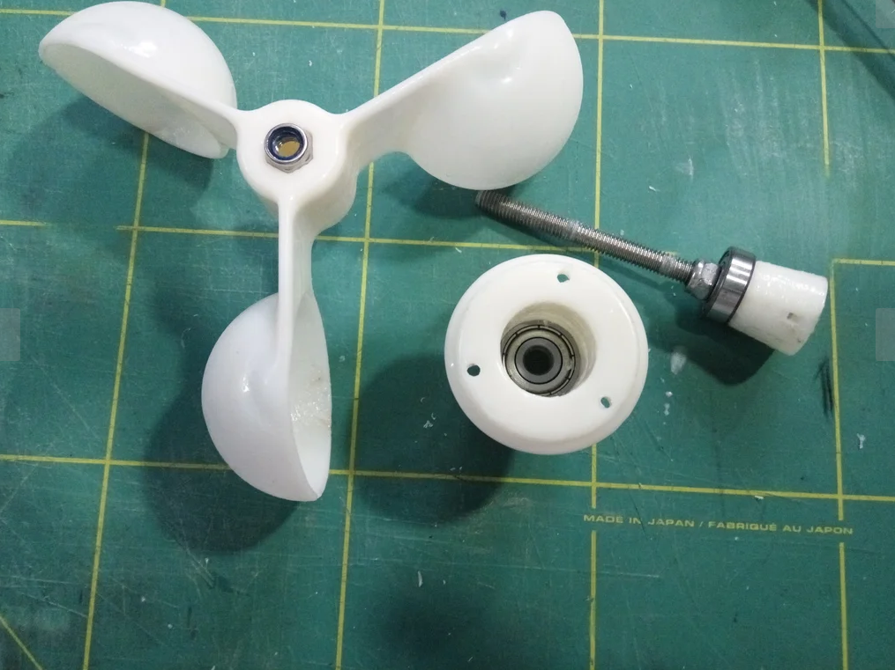
*The photo shows the old one-piece part — yours is three cups plus `base_cup_wheel`.*

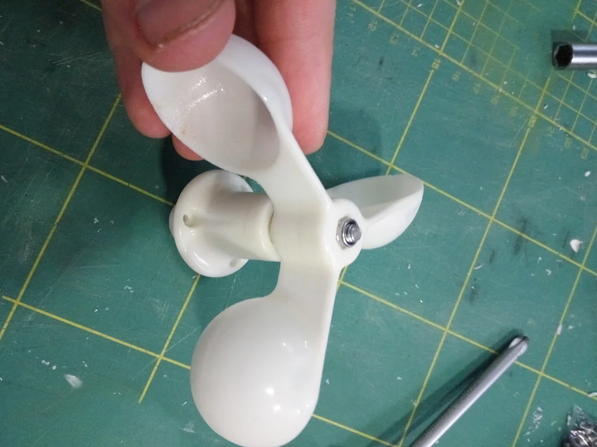
*Wheel screwed down, M5 stop nut visible.*

## Step 7 — Standpipe and mast base

1. **Drill a cable hole** near the top end of the **D10×1×300 mm aluminium tube**
   and deburr it. Cable jacket against a raw drilled edge chafes through.

   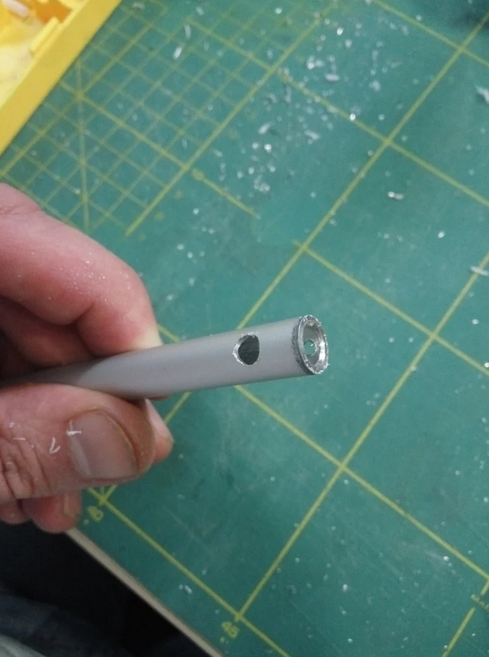

2. Feed the 12 V cable up the tube.
3. Push the tube into the socket in `bot.stl`.

> ### The tube is now 47.8 mm shorter than the original
> The socket was moved outboard along its own axis to make room for the Nano.
> The **angle is unchanged (20° below horizontal) and the bore is unchanged
> (Ø10)**, so the same tube and the same `base_power.stl` still fit — the tube
> just needs to be **47.8 mm shorter**, or the mast base moved 47.8 mm along the
> tube axis toward the sensor. Cut and deburr before you fit anything.

4. Fit the other end into `base_power.stl` and mount that to the masthead.

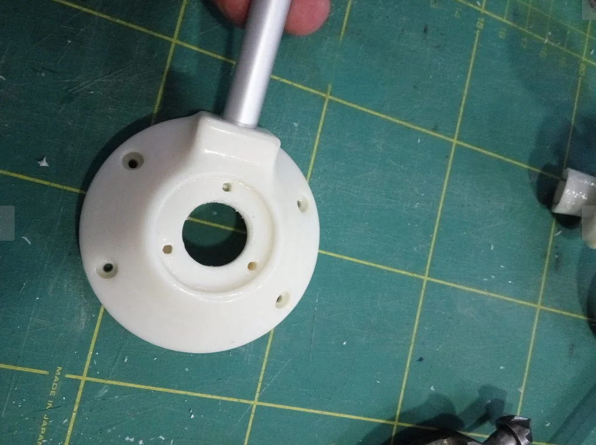
*Underside of `bot.stl` — bearing flange, centre bore, and the arm socket.*

## Step 8 — Board and wiring

The board is the one in [`circuit/Wind/`](../../circuit/Wind/) — see
[README.md](README.md#electronics-you-will-need-to-buy) for its parts list.

1. Route the 12 V pair through into the pocket **before** the board goes in.
2. Drop the board into the pocket in `bot.stl`. It locates on four bosses at
   ±15 / ±16 mm; the pocket has 0.4 mm clearance so it should drop in without
   force. If it binds, check for lacquer overspray in the pocket.
3. Fasten with **four M3×10 screws**.
4. Land the 12 V pair on terminal block **J2**. The cable comes up the tube,
   through the cable duct, and up the riser directly under J2.
5. **The Arduino Nano ESP32 goes in its socket on the underside of the board**,
   hanging down into the well beneath. Fit it after the board is screwed down.

### Sensor gaps — both matter

| Sensor | Gap | What it reads |
|---|---|---|
| Hall sensor (SS40AF) | **≈1 mm** from the magnet ring | wind speed |
| AS5600L | **≈1 mm** from the direction magnet | wind direction |

Too far and the reading drops out; touching and the wheel binds. Check both by
eye before closing up.

## Step 9 — Close it up

1. Check the pocket is clear of swarf and the cable is not pinched.
2. Fit `top_1.stl` over the board. The locating rib drops into the pocket.
3. Fasten with the four M3×10 screws at ±15 / ±25 mm, **plus the fifth screw at
   the nose tip (77.5, 0)** — that one is new and it is what keeps the long nose
   from lifting and letting water in.
4. Fit `top_2.stl`.

## Step 10 — Bench test

Do all of this on the bench. Nothing here is fun at the top of a mast.

1. Power up on 12 V.
2. **Spin the cups by hand.** Wind speed should rise and fall smoothly. If it
   reads roughly **double** what it should, the four speed magnets are not
   alternating — back to [Step 5](#step-5--speed-magnet-holder-and-lower-bearings).
3. **Turn the vane slowly through a full circle.** The angle should sweep 0–360°
   once, smoothly, with no jump or dead spot. A jump means the magnet is too far
   from the AS5600 or is not diametrically magnetised.
4. Point the vane at the bow mark and note the offset; correct it in firmware
   rather than by re-gluing the magnet.
5. Leave it running for an hour and check nothing heats up.

Only then take it up the mast.

---

## Credits and licence

Original design, and the assembly sequence these instructions follow:
**Norbert Walter**, [Open Boat Projects](https://open-boat-projects.org/en/zusammenbauanleitung-windsensor-yachta/)
— hardware and documentation **CC-BY-NC-SA**, firmware **GPL-3.0**.
Upstream project: <https://github.com/norbert-walter/Windsensor_Yachta>

Photographs in `assets/wind/` are from that project. This rewrite covers our
changes: the Nano ESP32 board, the extended housing, the relocated arm socket,
and the three-piece cup wheel. No images were copied from the upstream site —
everything here was already in `assets/wind/`.
