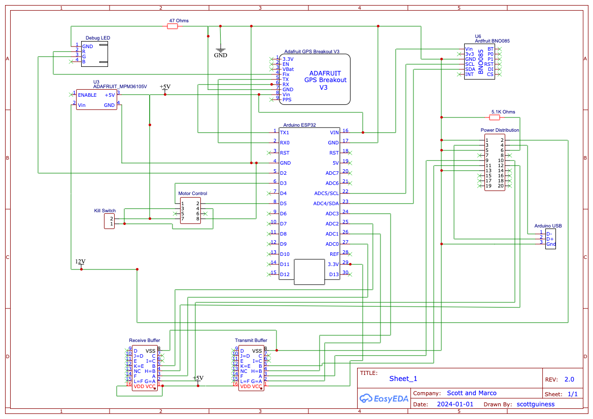
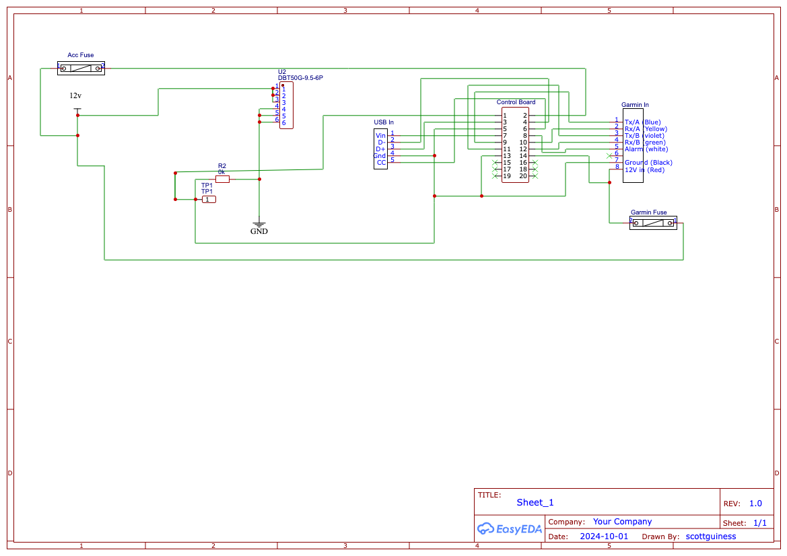
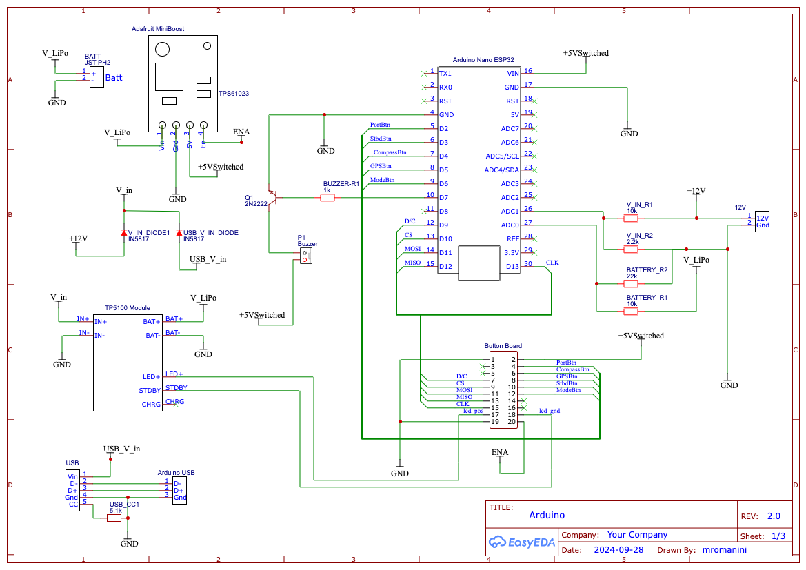
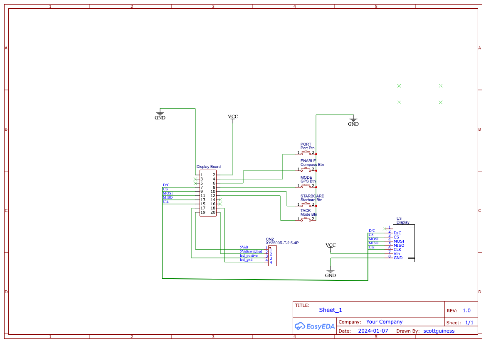

# AutoPilot circuit boards

This directory holds the **EasyEDA exports** for every custom PCB in the
AutoPilot project. There are four boards, grouped by the unit they belong to:

```
circuit/
├── Controller/
│   ├── Controller/      AP-Controller   — the autopilot brain
│   └── 12-volt-power/   12-volt-power   — power + NMEA interconnect board
└── Display/
    ├── Display/         AP-Display-2.1  — cockpit head-unit mainboard
    └── Button/          AP-Button-LED-V2 — button + TFT pass-through board
```

These PCBs implement the hardware described in [`../Arduino/README.md`](../Arduino/README.md):
the **controller** reads the sensors and drives the steering motor; the
**display** is the cockpit head unit with an LCD and buttons. Both are built
around the **Arduino Nano ESP32**, and they talk to each other over the
`SoberPilot` Wi-Fi network.

## What's in each folder

Every board was exported from EasyEDA with the full set of files:

| File | What it is |
|------|------------|
| `SCH_*.png` | Schematic, as a quick-look image |
| `SCH_*_EasyEDA.json` | Editable schematic source (open in EasyEDA) |
| `SCH_*_Altium.schdoc` | Schematic exported for Altium Designer |
| `PCB_*.png` | PCB layout, top view |
| `PCB_*_EasyEDA.json` | Editable PCB source (open in EasyEDA) |
| `PCB_*_Gerber.zip` | **Gerbers — send this to the board house to fabricate** |
| `PCB_*.dxf` | Board outline / layers as DXF (CAD, enclosures) |
| `PCB_*_OBJ.zip` | 3D model of the assembled board (.obj) |
| `PCB_*_Photo-View.svg` | Photo-realistic render of the populated board |
| `PCB_*_Autorouter.dsn` | Specctra DSN for external auto-routing |

To fabricate a board, upload its `*_Gerber.zip` to a PCB house (JLCPCB, PCBWay,
OSH Park, etc.). To edit a board, import the `*_EasyEDA.json` files back into
EasyEDA.

---

## 1. Controller board — `Controller/Controller/` (`AP-Controller`, rev 2.0)

The main board of the autopilot. It carries the Arduino Nano ESP32 and all of
its sensors, and breaks out the steering-motor and power connections.



### Components

| Ref | Part | Role |
|-----|------|------|
| **U1** | **Arduino Nano ESP32** | The brain — runs the controller firmware, the PID steering loop, and the `SoberPilot` Wi-Fi access point |
| **U6** | **Adafruit BNO085** (BNO08x 9-DOF IMU) | Fused compass / heading, pitch and roll, plus motion "stability" — connected over I²C (SCL/SDA) |
| **U4 / V3** | **Adafruit GPS Breakout** | GPS position, speed and course, NMEA over the ESP32 UART (TX/RX) |
| **U3** | **Adafruit MPM3610 5 V module** | 12 V → 5 V buck regulator that powers the board; gated by an `ENABLE` line |
| **U2** | **CD4010BE** hex buffer (TI) | "Receive Buffer" — level-shifts/buffers the incoming serial line |
| **U5** | **CD4010BE** hex buffer (TI) | "Transmit Buffer" — level-shifts/buffers the outgoing serial line |
| **R1** | 47 Ω | Current limit for the on-board **Debug LED** |
| **R2** | 5.1 kΩ | USB-C `CC` pull-down on the Arduino USB connector |
| — | HDR-M 2×4 | **Motor Control** header (out to the steering-motor driver) |
| — | JST-XH 2-pin | **Kill Switch** input |
| — | HDR-M 2×10 | **Power Distribution** header (12 V in / interconnect to the 12-volt-power board) |
| — | JST-XH 1×3/1×4 | Sensor + USB break-out connectors |

The two **CD4010 hex buffers** sit between the ESP32's 3.3 V logic and the
external 5 V / NMEA serial world, buffering the receive and transmit lines so the
Garmin / GPS serial signals are cleanly level-matched before they reach the
microcontroller.

---

## 2. 12-volt power board — `Controller/12-volt-power/` (`12-volt-power`, rev 1.0)

A passive **power-distribution and interconnect board** that lives next to the
controller. It brings the boat's 12 V supply, the Garmin NMEA feed and a USB port
onto one board, fuses them, and hands them off to the controller through a single
ribbon header.



### Components

| Ref | Part | Role |
|-----|------|------|
| **U2** | **DBT50G-9.5-6P** terminal/power connector | Main 12 V power entry block |
| — | **Garmin In** connector | Garmin NMEA-0183 feed — Tx/A (blue), Rx/A (yellow), Tx/B (violet), Rx/B (green), Alarm (white), Ground (black), 12 V (red) |
| — | **USB-C** connector | USB-In break-out (Vin / D− / D+ / GND / CC) |
| — | 5×20 mm fuse holder (BLX-A) | **Acc Fuse** — protects the 12 V accessory rail |
| — | 5×20 mm fuse holder (BLX-A) | **Garmin Fuse** — protects the Garmin 12 V feed |
| **R2** | 10 kΩ (with test point **TP1**) | Pull / sense resistor on the interconnect |
| — | HDR-M 2×10 | **Control Board** header — ribbon to the controller's Power Distribution header |

Everything here is wiring and protection: it consolidates power and the Garmin
NMEA wiring, fuses the 12 V rails, and routes them to the controller over the
2×10 ribbon so the controller board itself stays clean.

---

## 3. Display mainboard — `Display/Display/` (`AP-Display-2.1`, rev 2.0)

The cockpit head-unit board. It carries a second Arduino Nano ESP32, drives the
**HX8357 TFT** over SPI, and includes an on-board **LiPo battery + charger** so
the display can run with or without 12 V present. It also measures both the 12 V
input and the battery voltage.



### Components

| Ref | Part | Role |
|-----|------|------|
| **U1** | **Arduino Nano ESP32** | Runs the display firmware; SPI to the TFT (D/C, CS, MOSI, MISO, CLK) |
| **U3** | **TP5100 module** | 1–2 A Li-ion/LiPo battery charger (IN+/IN−, BAT+/BAT−, CHRG/STDBY status) |
| **TPS61023** | **Adafruit MiniBoost 5 V @ 1 A** | Boost converter — steps the LiPo up to 5 V to run the board (`+5V switched`) |
| **D1 / D2** | **1N5817** Schottky diodes | Power-OR the 12 V input and USB 5 V so either source can run the display |
| **Q1** | **2N2222A** NPN transistor | Drives the buzzer from a GPIO |
| **P1** | Buzzer | Audible alert |
| **R (BUZZER-R1)** | 1 kΩ | Base resistor for Q1 |
| **V_IN_R1 / V_IN_R2** | 10 kΩ / 2.2 kΩ | Voltage divider — measures the **12 V input** on an ADC pin |
| **BATTERY_R1 / BATTERY_R2** | 10 kΩ / 22 kΩ | Voltage divider — measures the **LiPo battery** on an ADC pin |
| **USB_CC1** | 5.1 kΩ | USB-C `CC` pull-down |
| — | JST-PH 2-pin (**BATT**) | LiPo battery connection |
| — | HDR-M 2×10 (**Button Board**) | Ribbon to the button / TFT pass-through board |
| — | JST-XH 1×3 / 1×5 | USB + power break-outs |

The two voltage dividers are what the firmware's `volt_meter.ino` reads to show
input and battery voltage on the LCD.

---

## 4. Button / LED board — `Display/Button/` (`AP-Button-LED-V2`, rev 1.0)

The board behind the cockpit buttons. It hosts the physical buttons, their
backlight LEDs, and **passes the TFT's SPI bus through** to the HX8357 display.



### Components

| Ref | Part | Role |
|-----|------|------|
| 5 × | **K2-1107ST** SMD tactile switches | The cockpit buttons: **Port**, **Enable** (compass), **Mode** (GPS), **Starboard**, **Tack** |
| **U3** | JST-XH 8-pin | Connector to the **HX8357 TFT** — passes D/C, CS, MOSI, MISO, CLK, Vin, GND |
| **CN2** | **XY2500R-T-2.5-4P** | Button **backlight LED** connection (5 V, 5 V-switched, LED+, LED−) |
| — | HDR-M 2×10 (**Display Board**) | Ribbon back to the display mainboard |

Functionally this board sits between the display mainboard and the TFT: the
2×10 ribbon brings the button signals and SPI bus over from the mainboard, the
buttons tie into the matching net labels (`PORT`, `ENABLE`, `MODE`, `STARBOARD`,
`TACK`), and the SPI bus continues out of U3 to the TFT. CN2 powers the button
backlights.

---

## How the boards fit together

```
        12 V boat supply ── Acc/Garmin fuses ──┐
        Garmin NMEA ───────────────────────────┤
        USB ───────────────────────────────────┤  12-volt-power board
                                                │  (fuse + interconnect)
                                                │
                                  2×10 ribbon ──┘
                                       │
                                ┌──────▼───────┐        steering motor
        BNO085 IMU ── I²C ──────│  CONTROLLER  │── 2×4 ──▶ (motor driver)
        Adafruit GPS ── UART ──│  Nano ESP32  │
        Kill switch ───────────│  + CD4010 ×2  │
                                └──────┬───────┘
                                       │  Wi-Fi  "SoberPilot"  (UDP)
                                       ▼
                                ┌──────────────┐
                                │   DISPLAY    │  LiPo + TP5100 charger
                                │  Nano ESP32  │  + TPS61023 5 V boost
                                └──────┬───────┘
                                       │ 2×10 ribbon
                                ┌──────▼───────┐
                                │ BUTTON board │── SPI ──▶ HX8357 TFT
                                │  5 buttons   │
                                └──────────────┘
```

For the firmware that runs on these boards, the pin assignments, and build
instructions, see [`../Arduino/README.md`](../Arduino/README.md). For the
overall system architecture and the UDP protocol, see the
[top-level README](../README.md).
