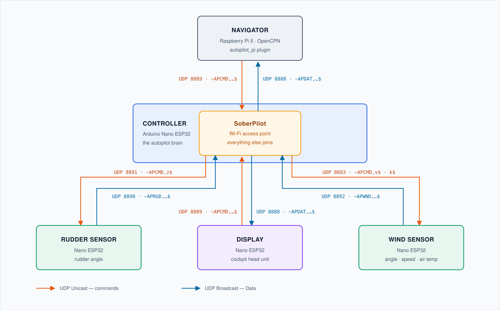
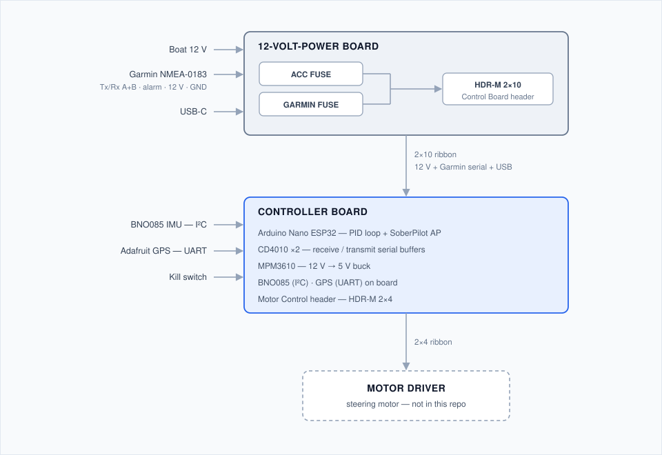
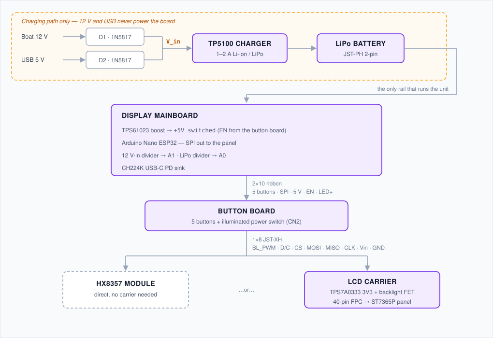

# AutoPilot circuit boards

This directory holds the **EasyEDA exports** for every custom PCB in the
AutoPilot project. There are seven boards, one directory each:

```
circuit/                                                                     unit
├── Controller/                 The Autopilot brain          rev 2.1  ─┐
├── Controller-12-volt-power/   power + NMEA interconnect    rev 1.0  ─┘─ controller
├── Display/                    cockpit head-unit mainboard  rev 2.2  ─┐
├── Display-Button/             buttons + TFT pass-through   rev 1.0   ├─ display
├── Display-LCD/                ST7365P panel carrier        rev 1.0  ─┘
├── Sensor-Rudder/              Inticator of rudder postion  rev 1.0  ─── rudder sensor
├── Sensor-Wind/                Wind speed and direction     rev 1.0  ─── wind sensor
└── tools/                      export automation (see tools/README.md)
```

These PCBs implement the hardware described in [`../Arduino/README.md`](../Arduino/README.md):
the **controller** reads the sensors and drives the steering motor, the
**display** is the cockpit head unit with an LCD and buttons, and the **rudder**
and **wind** sensors are standalone boards that report to the controller. All
four units are built around the **Arduino Nano ESP32** and talk to each other
over the `SoberPilot` Wi-Fi network.

## Seven boards, four enclosures

The directories are flat — one per EasyEDA project — but the boards are not
independent. They stack up into **four physical units**, and only the four
units talk to each other, over Wi-Fi:

| Unit | Boards inside it | Interconnect | Power |
|------|------------------|--------------|-------|
| **Controller** | [`Controller`](Controller/README.md) + [`Controller-12-volt-power`](Controller-12-volt-power/README.md) | 2×10 ribbon, board to board | 12 V into the power board, fused there |
| **Display** (cockpit head unit) | [`Display`](Display/README.md) + [`Display-Button`](Display-Button/README.md) + [`Display-LCD`](Display-LCD/README.md) | 2×10 ribbon mainboard→button board, then 8-pin JST-XH button board→panel | 12 V, or its own LiPo when 12 V is absent |
| **Rudder sensor** | [`Sensor-Rudder`](Sensor-Rudder/README.md) | — (single board) | 12 V into its own terminal block |
| **Wind sensor** | [`Sensor-Wind`](Sensor-Wind/README.md) | — (single board) | 12 V from the masthead light circuit |

So the two controller boards share one case, the three display boards share
another, and each sensor is a sealed one-board unit with nothing running to it
but a 12 V pair — which is the point of putting them on Wi-Fi rather than
wiring them back to the controller. [`Display-LCD`](Display-LCD/README.md) is
optional: it is only fitted when the ST7365P panel is used instead of an HX8357
module.

## What's in each folder

Every board is exported from EasyEDA with the same 13 files, produced by
[`tools/`](tools/README.md) (`npm run export`) rather than by hand. Filenames
follow `<SCH|PCB>_<board>_<type>.<ext>`. The `README.md` alongside them is the
one hand-written file in each directory; the exporter only ever adds, so a
re-export leaves it alone:

| File | What it is |
|------|------------|
| `SCH_*_PNG.png` / `SCH_*_SVG.svg` | Schematic, as a quick-look image |
| `SCH_*_EasyEDA.json` | Editable schematic source (open in EasyEDA) |
| `SCH_*_Altium.schdoc` | Schematic exported for Altium Designer |
| `PCB_*_PNG.png` / `PCB_*_SVG.svg` | PCB layout, top view |
| `PCB_*_EasyEDA.json` | Editable PCB source (open in EasyEDA) |
| `PCB_*_Gerber.zip` | **Gerbers — send this to the board house to fabricate** |
| `PCB_*_DXF.dxf` | Board outline / layers as DXF (CAD, enclosures) |
| `PCB_*_OBJ.zip` | 3D model of the assembled board (.obj) |
| `PCB_*_PhotoView-Top.svg` / `*-Bottom.svg` | Photo-realistic render of the populated board |
| `PCB_*_Autorouter.dsn` | Specctra DSN for external auto-routing |

To fabricate a board, upload its `*_Gerber.zip` to a PCB house (JLCPCB, PCBWay,
OSH Park, etc.). To edit a board, import the `*_EasyEDA.json` files back into
EasyEDA. To re-export everything after a change, see
[`tools/README.md`](tools/README.md).

---

## The seven boards

Each board directory has its own README with the schematic, the PCB image, a
component table and the design notes for that board:

| # | Board | EasyEDA project | What it is |
|---|-------|-----------------|------------|
| 1 | [`Controller/`](Controller/README.md) | `SM AP Controller` rev 2.1 | The autopilot brain — Nano ESP32, BNO085 IMU, GPS, CD4010 serial buffers, motor and kill-switch headers |
| 2 | [`Controller-12-volt-power/`](Controller-12-volt-power/README.md) | `SM AP Power` rev 1.0 | Passive power and NMEA interconnect — 12 V entry, Garmin feed, USB-C, two fuses, ribbon to the controller |
| 3 | [`Display/`](Display/README.md) | `SM AP Display` rev 2.2 | Head-unit mainboard — Nano ESP32, LiPo + TP5100 charger, TPS61023 boost, voltage dividers |
| 4 | [`Display-Button/`](Display-Button/README.md) | `SM Button board V2` rev 1.0 | Five cockpit buttons, illuminated power switch, SPI pass-through to the panel |
| 5 | [`Display-LCD/`](Display-LCD/README.md) | `AutoPilot LCD Carrier` v1.0 | Optional ST7365P panel carrier — 3V3 LDO, backlight FET, 40-pin FPC |
| 6 | [`Sensor-Rudder/`](Sensor-Rudder/README.md) | `SM AP Rudder Sensor` rev 1.0 | Rudder angle — Nano ESP32 + AS5600L magnetic encoder, 12 V in |
| 7 | [`Sensor-Wind/`](Sensor-Wind/README.md) | `SM AP Wind Sensor` rev 1.0 | Masthead unit — AS5600L vane, SS40AF Hall cup sensor, DS18B20 air temperature |

---

## How the boards fit together

The units talk to each other over Wi-Fi and nothing else. The controller hosts
the **SoberPilot** access point; the display, the two sensors and the navigator
(a Raspberry Pi 5 running OpenCPN) all join it as stations. Each sensor reports
on its own port and is commanded back on the next one up, while the display and
the navigator receive the telemetry broadcast and send commands to the
controller.



What is inside the controller and the display units follows below.

### Inside the controller unit

Everything from the outside world lands on the **12-volt-power** board, which
fuses it and hands it to the **controller** over one ribbon. The controller's
only outgoing connection is the motor header — the motor driver itself is a
bought part and is not one of these boards.



### Inside the display unit

Note the power path: **12 V and USB charge the battery and nothing else.** The
LiPo is the only thing that actually powers the display board, which then feeds
the button board and the panel.



For the firmware that runs on these boards, the pin assignments, and build
instructions, see [`../Arduino/README.md`](../Arduino/README.md). For the
overall system architecture and the UDP protocol, see the
[top-level README](../README.md). For re-exporting these files from EasyEDA,
see [`tools/README.md`](tools/README.md).

---

## Review notes (open items)

From a pass over all seven schematics, checked against the firmware. Nothing
here is a short or a crossed power rail — no net on any board carries two
different rail labels. These are the things to settle before the new boards go
out, roughly in order of how much they hurt.

**Board fix — confirmed**

1. **USB `D+`/`D−` are crossed on the display mainboard.** The USB connector's
   `D−` (pin 4) goes to the CH224K's `DP` *and* to the "Arduino USB" header's
   `D+`; `D+` (pin 5) goes to `DM` and to `D−`. The controller board wires the
   same 3-pin header straight through, so the two boards contradict each other.
   Confirmed as a genuine error — being fixed in EasyEDA; this export still has
   it. Re-export once corrected.

**Firmware TODO — next revision, once the new hardware is in hand**

Both of these are deferred deliberately: they are code changes that want the
real boards on the bench, not schematic changes.

2. **Display voltage dividers disagree with the firmware.** The schematic fits
   10 k/1.8 k (0.1525) and 10 k/12 k (0.5455); `display/volt_meter.ino` assumes
   0.1803 and 0.6875, i.e. 2.2 k and 22 k. Left as-is, the battery reads ~21 %
   low and the 12 V input ~15 % low.
3. **Nothing ever drives the LCD carrier's backlight.** `BL_PWM` runs from the
   mainboard's `D8` through the ribbon and the button board to the carrier's
   FET gate, and no code in `display/` touches `D8`. R5's 100 kΩ holds the gate
   low, so the panel lights up black. HX8357 modules hard-wire their backlight,
   which is why this has not bitten yet.

**Marginal / out of spec**

4. **The Transmit Buffer is a level shifter pointed the wrong way.** U5 has
   `VCC` = `VDD` = 5 V with 3.3 V ESP32 inputs; at `VDD` = 5 V the CD4010B needs
   `VIH` ≥ 3.5 V. It typically works at room temperature but is not guaranteed.
   The CD4010 only converts *down* — U2 (Receive) is wired correctly at
   `VDD` = 5 V, `VCC` = 3.3 V. A 74LVC part or a real NMEA driver is the fix.
5. **Indicator LEDs with no ballast.** The controller's kill-switch LED sits
   between +5 V and a saturated 2N2222 (the 1 kΩ is in the *base*), and the
   display's switch LED runs straight to the TP5100's `LED+`/`STDBY`. Both rely
   on the switch having an internal resistor.
6. **Power-switch polarity.** CN2's contacts bridge GND and the TPS61023's `EN`,
   which Adafruit's MiniBoost pulls high — so closing the switch turns the
   display *off*. Needs a normally-closed switch, or `EN` pulled down and
   switched to 5 V.

**Verify against datasheets**

7. **LCD backlight drive.** Three cathodes, each through 51 Ω, anodes on +5 V.
   That only works if each string is a single ~3.2 V LED; series strings cannot
   run from 5 V and would need a boost driver. Biggest unknown on the carrier.
8. **CH224K `CFG1` = 56 kΩ** selects a PD voltage that then lands on the
   TP5100's input through D2. The TP5100 is a 5–18 V part, so confirm both the
   CFG table and that more than 5 V is wanted here at all.
9. **USB-C `CC`.** The controller path terminates one `CC` pin with a single
   5.1 kΩ; if the receptacle brings out `CC1` and `CC2`, the cable will only
   work one way up. (The display is fine — the CH224K terminates both.)

**Housekeeping**

10. Ribbon conductors driven at one end and unconnected at the other:
    controller↔power pins 7 (USB VBUS) and 8 (Garmin alarm) into the controller,
    14 (Garmin 12 V) likewise, and 17–20 (motor rails) out of it. Running motor
    drive down the same ribbon as Garmin serial is also an EMI risk.
11. Neither Nano gets USB `VBUS` — both "Arduino USB" headers carry `D+`/`D−`
    and ground only.
12. No decoupling anywhere on the controller (neither CD4010, nor the 5 V rail);
    the display has only the CH224K's 1 µF. No reverse-polarity or transient
    protection on any 12 V input, and the masthead board has no fuse; the
    1N5817s are 20 V parts on a boat rail.
13. The GPS's `VBat` is unconnected, so it cold-starts every power-up.
14. `controller/garmin.ino`'s pin comment swaps the names of the Receive and
    Transmit buffers. The pin numbers are right.
15. The Display schematic's title block says "Sheet 1/3", but the project
    exports as a single sheet.
