# AutoPilot circuit boards

This directory holds the **EasyEDA exports** for every custom PCB in the
AutoPilot project. There are seven boards, one directory each:

```
circuit/                                                            unit
├── Controller/                 SM AP Controller    rev 2.1  ─┐
│                                 the autopilot brain          ├─ controller
├── Controller-12-volt-power/   SM AP Power         rev 1.0  ─┘
│                                 power + NMEA interconnect
├── Display/                    SM AP Display       rev 2.2  ─┐
│                                 cockpit head-unit mainboard  │
├── Display-Button/             SM Button board V2  rev 1.0   ├─ display
│                                 buttons + TFT pass-through   │
├── Display-LCD/                AutoPilot LCD Carrier   v1.0  ─┘
│                                 ST7365P panel carrier
├── Sensor-Rudder/              SM AP Rudder Sensor rev 1.0  ─── rudder sensor
├── Sensor-Wind/                SM AP Wind Sensor   rev 1.0  ─── wind sensor
└── tools/                      export automation (see tools/README.md)
```

These PCBs implement the hardware described in [`../Arduino/README.md`](../Arduino/README.md):
the **controller** reads the sensors and drives the steering motor, the
**display** is the cockpit head unit with an LCD and buttons, and the **rudder**
and **wind** sensors are standalone boards that report to the controller. All
four units are built around the **Arduino Nano ESP32** and talk to each other
over the `SoberPilot` Wi-Fi network.

## Seven boards, four enclosures

The directories are flat — one per EasyEDA project — but the boards are not
independent. They stack up into **four physical units**, and only the four
units talk to each other, over Wi-Fi:

| Unit | Boards inside it | Interconnect | Power |
|------|------------------|--------------|-------|
| **Controller** | `Controller` + `Controller-12-volt-power` | 2×10 ribbon, board to board | 12 V into the power board, fused there |
| **Display** (cockpit head unit) | `Display` + `Display-Button` + `Display-LCD` | 2×10 ribbon mainboard→button board, then 8-pin JST-XH button board→panel | 12 V, or its own LiPo when 12 V is absent |
| **Rudder sensor** | `Sensor-Rudder` | — (single board) | 12 V into its own terminal block |
| **Wind sensor** | `Sensor-Wind` | — (single board) | 12 V from the masthead light circuit |

So the two controller boards share one case, the three display boards share
another, and each sensor is a sealed one-board unit with nothing running to it
but a 12 V pair — which is the point of putting them on Wi-Fi rather than
wiring them back to the controller. `Display-LCD` is optional: it is only
fitted when the ST7365P panel is used instead of an HX8357 module (see board 5
below).

## What's in each folder

Every board is exported from EasyEDA with the same 13 files, produced by
[`tools/`](tools/README.md) (`npm run export`) rather than by hand. Filenames
follow `<SCH|PCB>_<board>_<type>.<ext>`:

| File | What it is |
|------|------------|
| `SCH_*_PNG.png` / `SCH_*_SVG.svg` | Schematic, as a quick-look image |
| `SCH_*_EasyEDA.json` | Editable schematic source (open in EasyEDA) |
| `SCH_*_Altium.schdoc` | Schematic exported for Altium Designer |
| `PCB_*_PNG.png` / `PCB_*_SVG.svg` | PCB layout, top view |
| `PCB_*_EasyEDA.json` | Editable PCB source (open in EasyEDA) |
| `PCB_*_Gerber.zip` | **Gerbers — send this to the board house to fabricate** |
| `PCB_*_DXF.dxf` | Board outline / layers as DXF (CAD, enclosures) |
| `PCB_*_OBJ.zip` | 3D model of the assembled board (.obj) |
| `PCB_*_PhotoView-Top.svg` / `*-Bottom.svg` | Photo-realistic render of the populated board |
| `PCB_*_Autorouter.dsn` | Specctra DSN for external auto-routing |

To fabricate a board, upload its `*_Gerber.zip` to a PCB house (JLCPCB, PCBWay,
OSH Park, etc.). To edit a board, import the `*_EasyEDA.json` files back into
EasyEDA. To re-export everything after a change, see
[`tools/README.md`](tools/README.md).

---

## 1. Controller board — `Controller/` (`SM AP Controller`, rev 2.1)

The main board of the autopilot. It carries the Arduino Nano ESP32 and all of
its sensors, and breaks out the steering-motor and power connections.

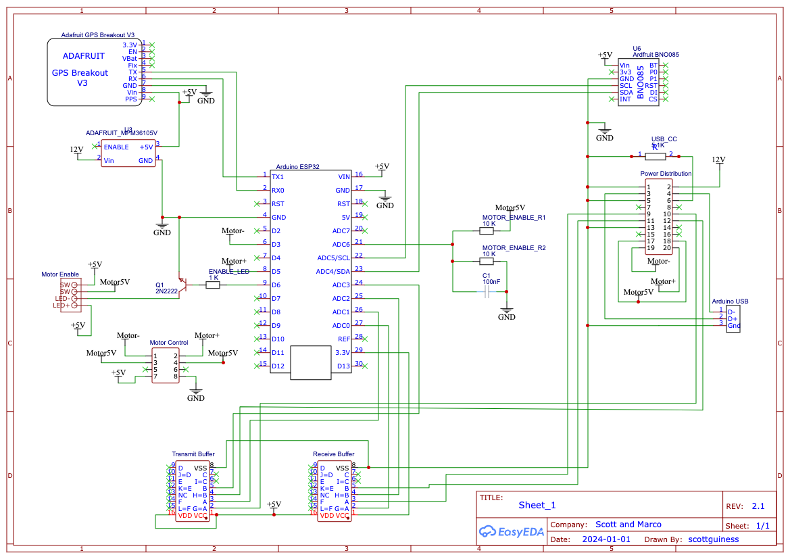

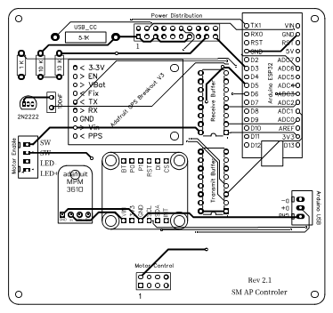

### Components

| Ref | Part | Role |
|-----|------|------|
| **U1** | **Arduino Nano ESP32** | The brain — runs the controller firmware, the PID steering loop, and the `SoberPilot` Wi-Fi access point |
| **U6** | **Adafruit BNO085** (BNO08x 9-DOF IMU) | Fused compass / heading, pitch and roll, plus motion "stability" — connected over I²C (SCL/SDA) |
| **U4 / V3** | **Adafruit GPS Breakout** | GPS position, speed and course, NMEA over the ESP32 UART (TX/RX) |
| **U3** | **Adafruit MPM3610 5 V module** | 12 V → 5 V buck regulator that powers the board. Its `ENABLE` pin is an explicit no-connect — it relies on the pull-up to `VIN` on Adafruit's breakout |
| **U2** | **CD4010BE** hex buffer (TI) | "Receive Buffer" — level-shifts/buffers the incoming serial line |
| **U5** | **CD4010BE** hex buffer (TI) | "Transmit Buffer" — level-shifts/buffers the outgoing serial line |
| **R1** | 47 Ω | Current limit for the on-board **Debug LED** |
| **R2** | 5.1 kΩ | USB-C `CC` pull-down on the Arduino USB connector |
| — | HDR-M 2×4 | **Motor Control** header (out to the steering-motor driver) |
| — | JST-XH 2-pin | **Kill Switch** input |
| — | HDR-M 2×10 | **Power Distribution** header (12 V in / interconnect to the 12-volt-power board) |
| — | JST-XH 1×3/1×4 | Sensor + USB break-out connectors |

The two **CD4010 hex buffers** sit between the ESP32's 3.3 V logic and the
external 5 V / NMEA serial world, buffering the receive and transmit lines so the
Garmin / GPS serial signals are cleanly level-matched before they reach the
microcontroller.

---

## 2. 12-volt power board — `Controller-12-volt-power/` (`SM AP Power`, rev 1.0)

A passive **power-distribution and interconnect board** that lives next to the
controller. It brings the boat's 12 V supply, the Garmin NMEA feed and a USB port
onto one board, fuses them, and hands them off to the controller through a single
ribbon header.

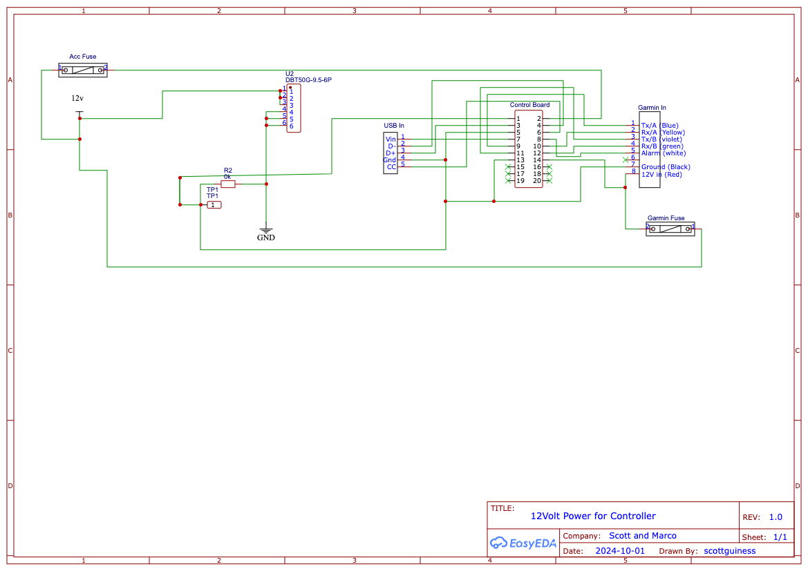

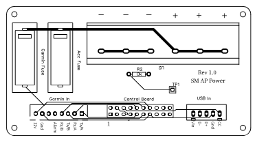

### Components

| Ref | Part | Role |
|-----|------|------|
| **U2** | **DBT50G-9.5-6P** terminal/power connector | Main 12 V power entry block |
| — | **Garmin In** connector | Garmin NMEA-0183 feed — Tx/A (blue), Rx/A (yellow), Tx/B (violet), Rx/B (green), Alarm (white), Ground (black), 12 V (red) |
| — | **USB-C** connector | USB-In break-out (Vin / D− / D+ / GND / CC) |
| — | 5×20 mm fuse holder (BLX-A) | **Acc Fuse** — protects the 12 V accessory rail |
| — | 5×20 mm fuse holder (BLX-A) | **Garmin Fuse** — protects the Garmin 12 V feed |
| **R2** | **0 Ω** link (with test point **TP1**) | The *only* bridge between the ribbon/Garmin/USB ground and the main power-connector ground — a star-ground link that can be lifted to break a loop or measure return current. Marked `0k` on the schematic |
| — | HDR-M 2×10 | **Control Board** header — ribbon to the controller's Power Distribution header |

Everything here is wiring and protection: it consolidates power and the Garmin
NMEA wiring, fuses the 12 V rails, and routes them to the controller over the
2×10 ribbon so the controller board itself stays clean.

---

## 3. Display mainboard — `Display/` (`SM AP Display`, rev 2.2)

The cockpit head-unit board. It carries a second Arduino Nano ESP32, drives the
TFT over SPI, and includes an on-board **LiPo battery + charger** so the display
can run with or without 12 V present. It also measures both the 12 V input and
the battery voltage.

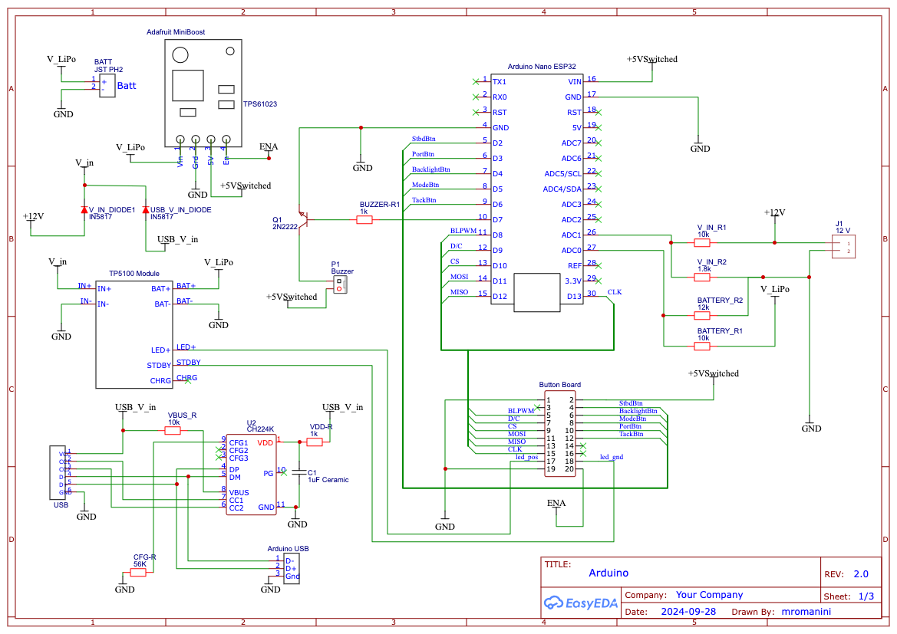

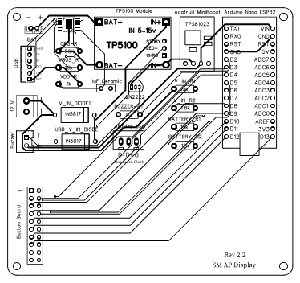

### Components

| Ref | Part | Role |
|-----|------|------|
| **U1** | **Arduino Nano ESP32** | Runs the display firmware; SPI to the TFT (D/C, CS, MOSI, MISO, CLK) |
| **U3** | **TP5100 module** | 1–2 A Li-ion/LiPo battery charger (IN+/IN−, BAT+/BAT−, CHRG/STDBY status) |
| **TPS61023** | **Adafruit MiniBoost 5 V @ 1 A** | Boost converter — steps the LiPo up to 5 V to run the board (`+5V switched`) |
| **D1 / D2** | **1N5817** Schottky diodes | OR the 12 V input and USB 5 V onto `V_in`, the TP5100's **charger** input — neither one runs the board directly |
| **Q1** | **2N2222A** NPN transistor | Drives the buzzer from a GPIO |
| **P1** | Buzzer | Audible alert |
| **R (BUZZER-R1)** | 1 kΩ | Base resistor for Q1 |
| **V_IN_R1 / V_IN_R2** | 10 kΩ / **1.8 kΩ** | Voltage divider — measures the **12 V input** on `A1` (ratio 0.1525) |
| **BATTERY_R1 / BATTERY_R2** | 10 kΩ / **12 kΩ** | Voltage divider — measures the **LiPo battery** on `A0` (ratio 0.5455) |
| **U2** | **CH224K** | USB-C PD sink — negotiates on `CC1`/`CC2` (it provides both Rd terminations, so no external 5.1 kΩ), `CFG1` = 56 kΩ selects the requested voltage |
| — | JST-PH 2-pin (**BATT**) | LiPo battery connection |
| — | HDR-M 2×10 (**Button Board**) | Ribbon to the button / TFT pass-through board |
| — | JST-XH 1×3 / 1×5 | USB + power break-outs |

The two voltage dividers are what the firmware's `volt_meter.ino` reads to show
input and battery voltage on the LCD. **The ratios in that file (0.1803 and
0.6875, i.e. 2.2 kΩ and 22 kΩ) do not match the resistors on this schematic** —
see the review notes at the end of this file.

**The display always runs off its battery.** 12 V and USB are *charging* inputs
only: both feed `V_in` through their Schottky diodes, `V_in` goes to the
TP5100's `IN+` and nowhere else, and the board's own `+5V switched` rail comes
from the TPS61023 boosting the LiPo. Pulling 12 V and USB does not turn the
display off, and the boost's `EN` line (from the button board) is what actually
switches the unit on.

---

## 4. Button / LED board — `Display-Button/` (`SM Button board V2`, rev 1.0)

The board behind the cockpit buttons. It hosts the five physical buttons, the
illuminated power switch connector, and **passes the TFT's SPI bus through** to
the display panel.

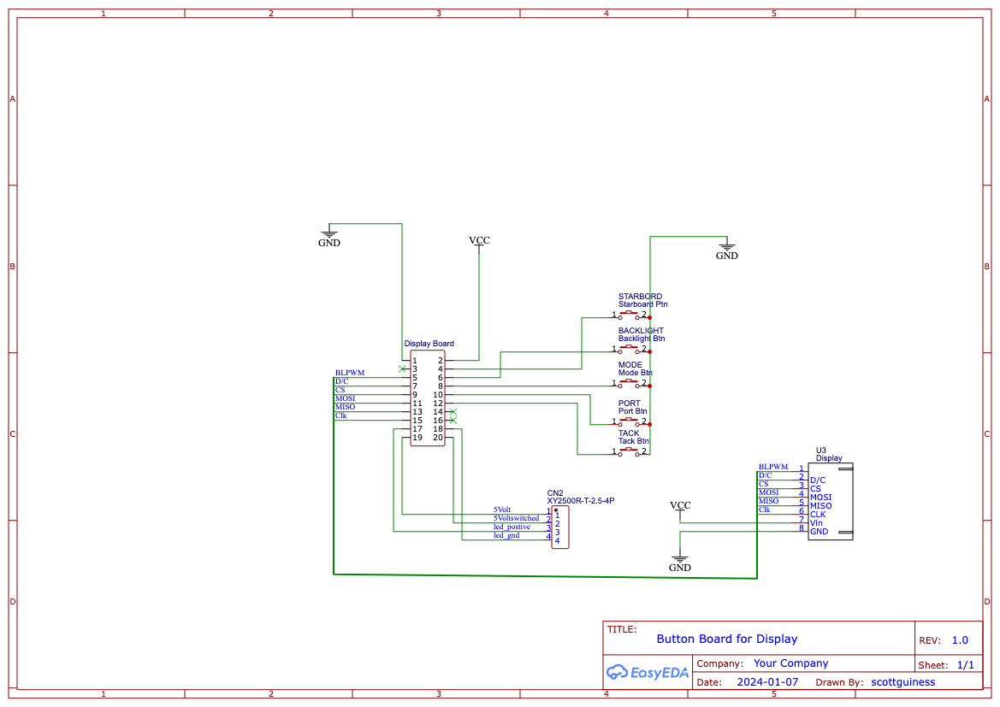

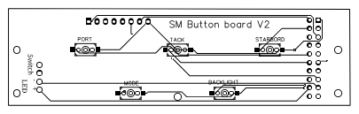

### Components

| Ref | Part | Role |
|-----|------|------|
| 5 × | **K2-1107ST** SMD tactile switches | The cockpit buttons: **Port**, **Enable** (compass), **Mode** (GPS), **Starboard**, **Tack** |
| **U3** | JST-XH 8-pin | Connector to the TFT — passes D/C, CS, MOSI, MISO, CLK, Vin, GND |
| **CN2** | **XY2500R-T-2.5-4P** | **Illuminated power switch.** Pins 1/2 (net-named `5Volt` / `5Voltswitched`, but actually GND and the TPS61023's `EN` on the mainboard) are the switch contacts; pins 3/4 are its LED, driven by the TP5100's `LED+` / `STDBY` charge-status pins |
| — | HDR-M 2×10 (**Display Board**) | Ribbon back to the display mainboard |

Functionally this board sits between the display mainboard and the panel: the
2×10 ribbon brings the button signals and SPI bus over from the mainboard, the
buttons tie into the matching net labels, and the SPI bus continues out of U3 —
either straight to an HX8357 module, or to the LCD carrier board below. CN2
powers the button backlights.

One naming trap: the display mainboard calls the fifth button's net
`BacklightBtn`, but the firmware currently reads that pin (`D4`) as
`NAVIGATION_DISABLE_BUTTON_PIN` — today it is the **Enable** button. The net
name is deliberate and forward-looking: once these boards are in, enable/disable
moves to the motor **kill switch** on the controller, which frees this button up
to do what its net says.

---

## 5. LCD carrier — `Display-LCD/` (`AutoPilot LCD Carrier`, v1.0)

Adapts the **VIEWE UEED035HV-RX40-L001A** panel (Sitronix **ST7365P**
controller, 320×480) to the same 8-pin JST-XH the button board already speaks.
It is the alternative to fitting an HX8357 breakout — the display firmware
detects which panel is present at boot (`tft.ino`) and drives either one.

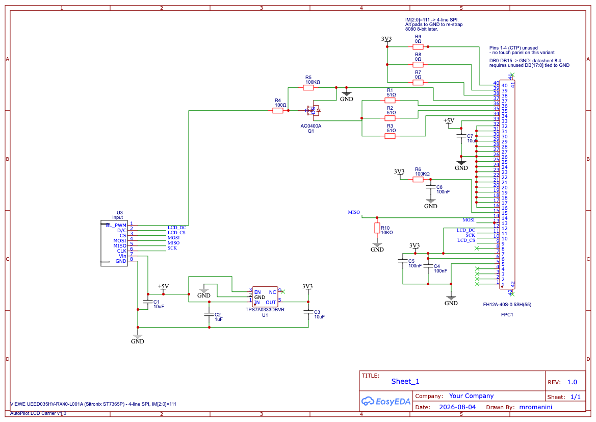

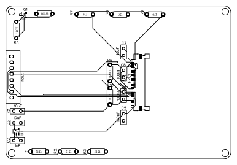

### Components

| Ref | Part | Role |
|-----|------|------|
| **U3** | JST-XH 8-pin (**Input**) | From the button board: `BL_PWM`, `D/C`, `CS`, `MOSI`, `MISO`, `CLK`, Vin (5 V), GND |
| **FPC1** | **HRS FH12A-40S-0.5SH(55)** | 40-pin 0.5 mm FPC connector the panel's flex tail plugs into |
| **U1** | **TI TPS7A0333DBVR** | 3.3 V LDO — the panel logic runs at 3V3 while the ribbon arrives at 5 V (C1 10 µF in, C2 1 µF, C3 10 µF out) |
| **Q1** | **AO3400A** N-channel MOSFET | Low-side switch for the **backlight**, gated by `BL_PWM` (R4 100 Ω gate series, R5 100 kΩ pull-down) |
| **R1–R3** | 51 Ω | Ballast for the three backlight LED strings (FPC 34/35/36; anodes on 5 V at FPC 33) |
| **R7–R9** | 0 Ω | `IM[2:0]` strapped to 3V3 = **111 → 4-line SPI**. Alternate pads to GND re-strap the panel to 8080 8-bit later |
| **R6 / C8** | 100 kΩ / 100 nF | Power-on **reset** for the panel (FPC 15) |
| **R10** | 10 kΩ | `MISO` pull-down |
| **C4–C7** | 100 nF / 10 µF | Panel 3V3 and backlight-rail decoupling |

Only the 4-line SPI pins are wired: `CS` (9), `SCK` (10), `D/C` (11), `MOSI`
(13) and `MISO` (14). The unused parallel bus `DB[17:0]` (FPC 16–32) is tied to
**GND**, which the panel's datasheet §8.4 requires, and the four capacitive-touch
pins (FPC 1–4) are left unconnected — this panel variant has no touch layer.

---

## 6. Rudder sensor — `Sensor-Rudder/` (`SM AP Rudder Sensor`, rev 1.0)

A standalone board that reports rudder angle to the controller over Wi-Fi
(UDP 8890/8891) — the boat is wheel-steered, so the controller has no other way
to know where the rudder actually is. It is a unit on its own: one board in its
own case down by the quadrant, with nothing running to it but a 12 V pair.
Deliberately minimal — a Nano ESP32, a magnetic angle encoder, and 12 V in.

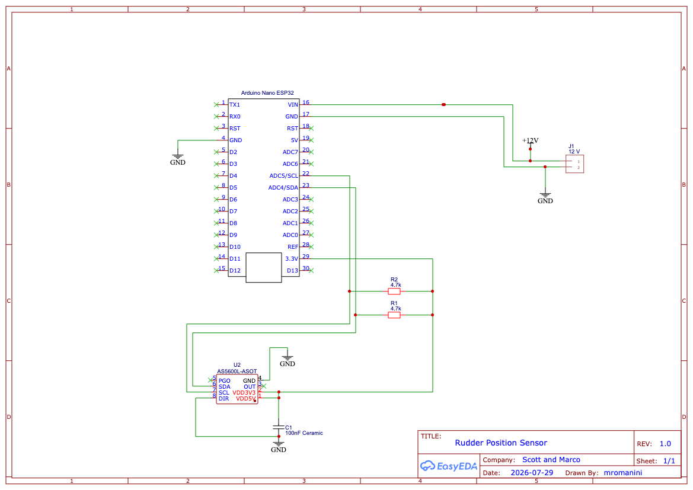

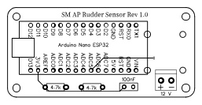

### Components

| Ref | Part | Role |
|-----|------|------|
| **U1** | **Arduino Nano ESP32** | Runs the `rudder/` sketch; joins **SoberPilot** as a station |
| **U2** | **AMS AS5600L-ASOT** (SOIC-8) | Contactless 12-bit magnetic rotary encoder — reads the angle of a magnet on the rudder stock |
| **R1 / R2** | 4.7 kΩ | I²C pull-ups on `SDA` / `SCL` to **3V3** |
| **C1** | 100 nF | AS5600L decoupling |
| **J1** | 2-pin 3.5 mm terminal block | **12 V** in, straight to the Nano's `VIN` |

Both AS5600L supply pins (`VDD5V`, `VDD3V3`) are tied to the Nano's **3V3**
pin, not 5 V — a 5 V-powered module would pull the I²C lines above what the
ESP32's 3.3 V-only GPIOs tolerate. `DIR` is tied to GND, fixing the direction of
increasing counts. The sensor sits on the Nano's dedicated `SDA`/`SCL` pins
(`ADC4/SDA`, `ADC5/SCL`); everything else on the Nano is unused.

Centring is a runtime command (`~APCMD,z$`), not a build constant, so the
zero offset can be set with the rudder physically amidships and is persisted in
NVS — see [`../Arduino/README.md`](../Arduino/README.md).

---

## 7. Wind sensor — `Sensor-Wind/` (`SM AP Wind Sensor`, rev 1.0)

The masthead board. Same idea as the rudder sensor — a standalone Nano ESP32
joining SoberPilot and unicasting to the controller (UDP 8892/8893) — but with
three sensors on it: apparent wind angle, wind speed, and air temperature. The
long tapered outline is shaped to fit the Yachta sensor head, which is the
enclosure for this unit (see [`../cad/wind/`](../cad/wind/)); the only wiring up
the mast is 12 V from the masthead light circuit.

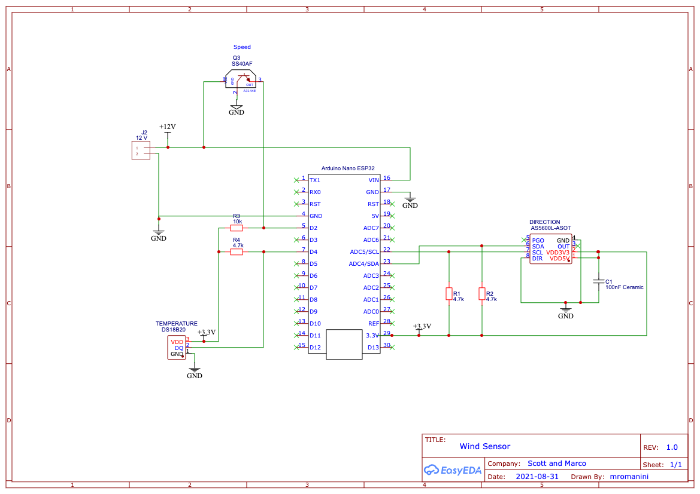

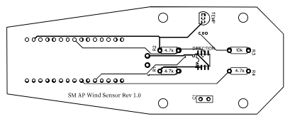

### Components

| Ref | Part | Role |
|-----|------|------|
| **U1** | **Arduino Nano ESP32** | Runs the `wind/` sketch; joins **SoberPilot** as a station |
| **DIRECTION** | **AMS AS5600L-ASOT** (SOIC-8) | Wind **vane** angle — magnetic encoder on the vane spindle, on `SDA`/`SCL` |
| **Q3** | **Honeywell SS40AF** Hall-effect switch (A3144E footprint) | Wind **speed** — one pulse per cup-wheel magnet pass, open-collector output to `D2` |
| **TEMPERATURE** | **DS18B20** (TO-92) | Air temperature on 1-Wire |
| **R1 / R2** | 4.7 kΩ | I²C pull-ups on `SDA` / `SCL` to **3V3** |
| **R3** | 10 kΩ | Pull-up on the Hall sensor's open-collector output to **3V3** |
| **R4** | 4.7 kΩ | 1-Wire pull-up on the DS18B20 data line to **3V3** |
| **C1** | 100 nF | AS5600L decoupling |
| **J2** | 2-pin 3.5 mm terminal block | **12 V** in (masthead light circuit), to the Nano's `VIN` |

As on the rudder board, the AS5600L runs off **3V3** with `DIR` to GND. The
Hall switch is the one part fed from **12 V** (SS40AF is rated 3.8–30 V); its
open-collector output is pulled up to 3V3, so the ESP32 still only ever sees
3.3 V logic.

Pin assignments match the `wind/` sketch: cup speed on `D2`
(`WIND_SPEED_PIN`), DS18B20 on `D4` (`ONE_WIRE_PIN`), vane on the dedicated
I²C pins.

Both the vane zero and the wind-speed calibration are runtime commands
persisted in NVS, so a unit that is already up the mast never has to be
reflashed to be calibrated — see [`../Arduino/README.md`](../Arduino/README.md).

---

## How the boards fit together

```
        12 V boat supply ── Acc/Garmin fuses ──┐
        Garmin NMEA ───────────────────────────┤
        USB ───────────────────────────────────┤  12-volt-power board
                                               │  (fuse + interconnect)
                                               │
                                 2×10 ribbon ──┘
                                      │
                               ┌──────▼───────┐        steering motor
        BNO085 IMU ── I²C ─────│  CONTROLLER  │── 2×4 ──▶ (motor driver)
        Adafruit GPS ── UART ──│  Nano ESP32  │
        Kill switch ───────────│  + CD4010 ×2 │
                               └──────┬───────┘
                                      │  Wi-Fi  "SoberPilot"  (UDP)
             ┌────────────────────────┼────────────────────────┐
             │ 8890/8891              │ 8888/8889              │ 8892/8893
      ┌──────▼───────┐         ┌──────▼───────┐         ┌──────▼───────┐
      │RUDDER SENSOR │         │   DISPLAY    │         │ WIND SENSOR  │
      │ Nano ESP32   │         │  Nano ESP32  │         │ Nano ESP32   │
      │ + AS5600L    │         │  LiPo+TP5100 │         │ + AS5600L    │
      └──────────────┘         │  +TPS61023   │         │ + SS40AF     │
                               └──────┬───────┘         │ + DS18B20    │
                                      │ 2×10 ribbon     └──────────────┘
                               ┌──────▼───────┐
                               │ BUTTON board │── SPI ──┬──▶ HX8357 module
                               │  5 buttons   │         │
                               └──────────────┘         └──▶ LCD CARRIER ──▶
                                                            (40-pin FPC)
                                                            ST7365P panel
```

### Inside the controller unit

Everything from the outside world lands on the **12-volt-power** board, which
fuses it and hands it to the **controller** over one ribbon. The controller's
only outgoing connection is the motor header — the motor driver itself is a
bought part and is not one of these boards.

```
    boat 12 V ──────────┐
                        │   ┌───────────────────────────┐
                        ├──▶│  12-VOLT-POWER board      │
    Garmin NMEA-0183 ───┤   │                           │
     (Tx/Rx A+B, alarm, │   │  Acc fuse  ─┐             │
      12 V, GND)        │   │  Garmin fuse┴─▶ HDR 2×10  │
                        │   │                           │
    USB-C ──────────────┘   └────────────┬──────────────┘
                                         │
                                    2×10 ribbon
                              (12 V + Garmin serial + USB)
                                         │
                            ┌────────────▼──────────────┐
    BNO085 IMU ── I²C ─────▶│  CONTROLLER board         │
    Adafruit GPS ── UART ──▶│                           │
    Kill switch ───────────▶│  Nano ESP32               │
                            │  CD4010 ×2  (serial buf)  │
                            │  MPM3610    (12 V→5 V)    │
                            └────────────┬──────────────┘
                                         │
                                    2×4 ribbon
                                         │
                                         ▼
                              ┌──────────────────────┐
                              │  motor driver        │  ← not in this repo
                              │  (steering motor)    │
                              └──────────────────────┘
```

### Inside the display unit

Note the power path: **12 V and USB charge the battery and nothing else.** The
LiPo is the only thing that actually powers the display board, which then feeds
the button board and the panel.

```
    boat 12 V ──▶│D1 (1N5817)│─┐
                               ├──▶ V_in ──▶ TP5100 charger ──▶ ┌─────────┐
    USB 5 V ────▶│D2 (1N5817)│─┘         (charging only)        │  LiPo   │
                                                                └────┬────┘
                                                                     │
                                    ┌────────────────────────────────▼───┐
                                    │  DISPLAY board                     │
                                    │                                    │
                                    │  TPS61023 boost ──▶ +5V switched   │
                                    │  Nano ESP32                        │
                                    │  V_in ÷ and V_LiPo ÷ ──▶ ADC       │
                                    └───────────────┬────────────────────┘
                                                    │
                                             2×10 ribbon
                                    (5 sw. buttons, SPI, 5 V, EN, LED)
                                                    │
                                    ┌───────────────▼────────────────────┐
                                    │  BUTTON board                      │
                                    │  5 buttons + backlight LEDs        │
                                    └───────────────┬────────────────────┘
                                                    │
                                              1×8 JST-XH
                                 (BL_PWM, D/C, CS, MOSI, MISO, CLK, Vin, GND)
                                                    │
                            ┌───────────────────────┴───────────────────────┐
                            │                                               │
                  ┌─────────▼──────────┐                    ┌───────────────▼────────────┐
                  │  HX8357 module     │       ...or...     │  LCD CARRIER board         │
                  │  (direct, no       │                    │  TPS7A0333 3V3 + backlight │
                  │   carrier needed)  │                    │  FET, 40-pin FPC ──▶       │
                  └────────────────────┘                    │  ST7365P panel             │
                                                            └────────────────────────────┘
```

For the firmware that runs on these boards, the pin assignments, and build
instructions, see [`../Arduino/README.md`](../Arduino/README.md). For the
overall system architecture and the UDP protocol, see the
[top-level README](../README.md). For re-exporting these files from EasyEDA,
see [`tools/README.md`](tools/README.md).

---

## Review notes (open items)

From a pass over all seven schematics, checked against the firmware. Nothing
here is a short or a crossed power rail — no net on any board carries two
different rail labels. These are the things to settle before the new boards go
out, roughly in order of how much they hurt.

**Board fix — confirmed**

1. **USB `D+`/`D−` are crossed on the display mainboard.** The USB connector's
   `D−` (pin 4) goes to the CH224K's `DP` *and* to the "Arduino USB" header's
   `D+`; `D+` (pin 5) goes to `DM` and to `D−`. The controller board wires the
   same 3-pin header straight through, so the two boards contradict each other.
   Confirmed as a genuine error — being fixed in EasyEDA; this export still has
   it. Re-export once corrected.

**Firmware TODO — next revision, once the new hardware is in hand**

Both of these are deferred deliberately: they are code changes that want the
real boards on the bench, not schematic changes.

2. **Display voltage dividers disagree with the firmware.** The schematic fits
   10 k/1.8 k (0.1525) and 10 k/12 k (0.5455); `display/volt_meter.ino` assumes
   0.1803 and 0.6875, i.e. 2.2 k and 22 k. Left as-is, the battery reads ~21 %
   low and the 12 V input ~15 % low.
3. **Nothing ever drives the LCD carrier's backlight.** `BL_PWM` runs from the
   mainboard's `D8` through the ribbon and the button board to the carrier's
   FET gate, and no code in `display/` touches `D8`. R5's 100 kΩ holds the gate
   low, so the panel lights up black. HX8357 modules hard-wire their backlight,
   which is why this has not bitten yet.

**Marginal / out of spec**

4. **The Transmit Buffer is a level shifter pointed the wrong way.** U5 has
   `VCC` = `VDD` = 5 V with 3.3 V ESP32 inputs; at `VDD` = 5 V the CD4010B needs
   `VIH` ≥ 3.5 V. It typically works at room temperature but is not guaranteed.
   The CD4010 only converts *down* — U2 (Receive) is wired correctly at
   `VDD` = 5 V, `VCC` = 3.3 V. A 74LVC part or a real NMEA driver is the fix.
5. **Indicator LEDs with no ballast.** The controller's kill-switch LED sits
   between +5 V and a saturated 2N2222 (the 1 kΩ is in the *base*), and the
   display's switch LED runs straight to the TP5100's `LED+`/`STDBY`. Both rely
   on the switch having an internal resistor.
6. **Power-switch polarity.** CN2's contacts bridge GND and the TPS61023's `EN`,
   which Adafruit's MiniBoost pulls high — so closing the switch turns the
   display *off*. Needs a normally-closed switch, or `EN` pulled down and
   switched to 5 V.

**Verify against datasheets**

7. **LCD backlight drive.** Three cathodes, each through 51 Ω, anodes on +5 V.
   That only works if each string is a single ~3.2 V LED; series strings cannot
   run from 5 V and would need a boost driver. Biggest unknown on the carrier.
8. **CH224K `CFG1` = 56 kΩ** selects a PD voltage that then lands on the
   TP5100's input through D2. The TP5100 is a 5–18 V part, so confirm both the
   CFG table and that more than 5 V is wanted here at all.
9. **USB-C `CC`.** The controller path terminates one `CC` pin with a single
   5.1 kΩ; if the receptacle brings out `CC1` and `CC2`, the cable will only
   work one way up. (The display is fine — the CH224K terminates both.)

**Housekeeping**

10. Ribbon conductors driven at one end and unconnected at the other:
    controller↔power pins 7 (USB VBUS) and 8 (Garmin alarm) into the controller,
    14 (Garmin 12 V) likewise, and 17–20 (motor rails) out of it. Running motor
    drive down the same ribbon as Garmin serial is also an EMI risk.
11. Neither Nano gets USB `VBUS` — both "Arduino USB" headers carry `D+`/`D−`
    and ground only.
12. No decoupling anywhere on the controller (neither CD4010, nor the 5 V rail);
    the display has only the CH224K's 1 µF. No reverse-polarity or transient
    protection on any 12 V input, and the masthead board has no fuse; the
    1N5817s are 20 V parts on a boat rail.
13. The GPS's `VBat` is unconnected, so it cold-starts every power-up.
14. `controller/garmin.ino`'s pin comment swaps the names of the Receive and
    Transmit buffers. The pin numbers are right.
15. The Display schematic's title block says "Sheet 1/3", but the project
    exports as a single sheet.
